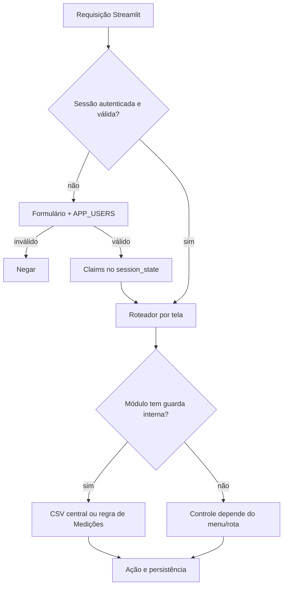

# APP FOS — Auditoria do controle de acesso

**Estado auditado:** `main` no commit `54bd51a3e24bf104fee0102957feea6429f75aac`.

**Natureza:** investigação estática e registro de baseline; nenhuma correção foi implementada.

**Escopo:** autenticação, autorização, acesso por obra, administração, superadmin, persistência e testes.

## 1. Resumo executivo

O APP FOS possui uma barreira de login aplicada antes do carregamento das páginas funcionais (`app.py:10-11`). Os usuários vêm do secret `APP_USERS`; uma autenticação válida grava identidade e perfil no `st.session_state`, e a sessão expira após uma hora de inatividade (`services/auth.py:9,13-17,77-134`). Assim, uma pessoa externa sem credencial válida não passa pelo fluxo normal da aplicação.

Depois do login, a autorização não é uniforme. O sistema combina:

1. perfil global em sessão (`services/auth.py:121-129`);
2. concessões por usuário, módulo, recurso, ação e obra em `data/permissoes_usuarios.csv` (`services/permissoes.py:16-25,119-214`);
3. vínculos e perfis próprios do módulo Medições em `data/medicoes/usuarios_obras.csv` (`modulos/medicoes/permissoes.py:13-133`).

O menu usa permissões para ocultar cartões, mas várias rotas do despachante não repetem a validação dentro da página. Férias, Uniformes/EPIs, Administração e Medições possuem revalidações internas; Dados, CRM, Obras e o Orçamento legado não usam a autorização central em seus pontos de entrada. Portanto, nessas rotas a proteção adicional ao login é predominantemente a seleção visual do menu e o valor de `tela` em sessão (`app.py:16-155`; `pages/menu.py:7-20,186-274`). Isso é uma fronteira incompleta, embora a auditoria estática não demonstre, por si só, que um cliente remoto consiga alterar arbitrariamente o `session_state`.

Existe um conceito técnico de superadmin, definido exclusivamente por `perfil == "superadmin"` normalizado (`services/permissoes.py:111-116`). Não há no código uma identidade imutável de Fabio nem uma lista separada de proprietários. O privilégio nasce do campo `role` do usuário em `APP_USERS`; ao mesmo tempo, a função legada `exigir_admin()` aceita apenas o perfil literal `admin`, não `superadmin` (`services/auth.py:137-140`). Logo, o superadmin tem bypass nas permissões centrais, mas não é universal em todas as regras do APP.

Conclusão: a autenticação fornece uma barreira básica real; a autorização tem bons blocos reutilizáveis e comportamento central fail-closed, porém sua aplicação é parcial e fragmentada. A prioridade segura é centralizar guardas no roteador e nos pontos de persistência, sem depender do menu ou apenas de widgets desabilitados.

## 2. Arquitetura atual de autenticação

### 2.1 Fluxo completo

1. `app.py` chama `verificar_login()` e encerra a execução com `st.stop()` quando a resposta é falsa (`app.py:10-11`).
2. `inicializar_auth()` cria as chaves `autenticado`, `usuario`, `perfil`, `matricula`, `nome` e `ultimo_acesso` (`services/auth.py:20-31`).
3. O formulário recebe usuário e senha; a senha usa campo visual do tipo password (`services/auth.py:105-111`).
4. `carregar_usuarios()` desserializa o JSON do secret `APP_USERS`; qualquer falha retorna conjunto vazio (`services/auth.py:13-17`).
5. A comparação é direta entre a senha digitada e o campo `password` (`services/auth.py:116-119`). Não há hash verificado pelo código.
6. Em sucesso, identidade, perfil e horário são copiados para a sessão, `tela` recebe `menu` e um log de login é agendado (`services/auth.py:121-134`).
7. Em cada nova execução autenticada, `sessao_expirada()` aplica timeout deslizante de 3.600 segundos e atualiza `ultimo_acesso` (`services/auth.py:77-103`).
8. Logout registra evento quando possível, remove um conjunto definido de chaves e executa rerun (`services/auth.py:34-45,63-74`).

### 2.2 Credenciais e comportamento de falha

- Origem: JSON no secret `APP_USERS`; campos consumidos: chave de usuário, `password`, `role`, `matricula` e `nome` (`services/auth.py:13-17,116-127`).
- Armazenamento: o repositório não contém a fonte de usuários; o código espera senha comparável em texto. Esta auditoria não leu nem reproduz conteúdo de secrets.
- Comparação: igualdade direta e sensível a maiúsculas (`services/auth.py:117-118`).
- Erro inválido: mensagem genérica para usuário inexistente ou senha errada; a sessão permanece não autenticada (`services/auth.py:113-119`).
- Secret inválido/ausente: nenhum usuário é carregado, portanto o login falha fechado (`services/auth.py:13-17,116-119`).
- Bloqueio/rate limit/MFA: não encontrados no fluxo.
- Expiração de credencial e troca de senha: não encontradas no repositório.
- Revogação durante sessão: uma sessão autenticada não recarrega `APP_USERS`; remoção ou mudança de perfil só produz efeito após logout/expiração (`services/auth.py:89-103`).

### 2.3 Sessão e encerramento

O logout limpa apenas as chaves enumeradas em `limpar_sessao()` (`services/auth.py:34-45`). Chaves funcionais, como seletores, objetos em edição e fluxos de módulos, não são limpas globalmente. O impacto entre dois logins sucessivos no mesmo navegador precisa de teste dinâmico; o código demonstra persistência potencial de estado residual, não exposição confirmada.

Logs de login, logout e expiração são gravados em `data/log_acessos.csv` por `services/log.py:12-72`. Falhas de log são suprimidas para não bloquear autenticação (`services/auth.py:52-60,67-71,94-98`).

## 3. Arquitetura atual de autorização

### 3.1 Camada central

`services/permissoes.py` implementa:

| Função | Decisão | Padrão sem concessão |
|---|---|---|
| `eh_superadmin()` | perfil global normalizado igual a `superadmin` | falso |
| `permissoes_usuario()` | linhas ativas do usuário | DataFrame vazio |
| `pode_acessar_modulo(modulo)` | módulo exato ou `todos` | nega |
| `pode_executar(modulo,recurso,permissao,obra_id)` | todos os quatro eixos, com curingas | nega |
| `obras_permitidas(...)` | lista de obras das concessões compatíveis | lista vazia |

Referência: `services/permissoes.py:107-214`. Superadmin recebe bypass nessa camada (`services/permissoes.py:140-142,159-161,187-189`). Falha de leitura do CSV resulta em ausência de concessões (`services/permissoes.py:50-70,83-94`), isto é, fail-closed para consumidores centrais.

### 3.2 Aplicação por módulo

| Módulo/rota | Menu | Entrada/rota | Ação/persistência | Controle efetivo atual |
|---|---:|---:|---:|---|
| Administração | `eh_superadmin` | revalida e interrompe | página autorizada; gravação segura por SHA | real na entrada (`pages/administracao.py:93-107`) |
| Férias/Folgas | módulo | revalida | ações selecionadas usam `pode_executar`; ciclo de vida revalida antes de persistir | real e granular parcial (`pages/ferias.py:117-143,1458-1464`) |
| Uniformes/EPIs | módulo | revalida | edição depende de `pode_executar`; widgets ficam desabilitados | real na página, mas helpers de persistência não recebem identidade/autorização (`pages/uniformes_epis.py:753-790`) |
| Novo Orçamento | módulo | roteador passa `autorizado` ao render | fronteira explícita no módulo | real no ponto de entrada (`app.py:97-101`) |
| Medições | módulo central no menu | revalida vínculo próprio | navegação guarda lançar/aprovar/criar | real, porém em camada independente (`pages/medicoes.py:26-60`; `modulos/medicoes/navegacao.py:44-74,148-152,216-231`) |
| Prestação de contas | módulo no menu | rota geral sem guarda central | `Todas as Despesas` e `Tipos` exigem perfil global literal `admin`; outras áreas não | parcial (`app.py:54-57`; `pages/prestacao_contas.py:455-456,633-634`) |
| Dados | módulo no menu | sem revalidação central | funções salvam CSV sem argumento de autorização | predominantemente visual (`app.py:39-42`; `pages/dados.py:92-130,233-239,662-721`) |
| CRM | módulo no menu | sem revalidação central | repositório usa credencial de servidor | predominantemente visual (`app.py:87-90`; `pages/crm/repositorio.py:26-40`) |
| Obras | módulo no menu | sem revalidação central | render recebe token/repo | predominantemente visual (`app.py:103-126`) |
| Orçamento legado | módulo no menu | sem revalidação central | páginas usam token/repo de servidor | predominantemente visual (`app.py:128-151`; `pages/orcamento_old.py:16-17`) |

“Predominantemente visual” significa que a auditoria não encontrou uma segunda chamada de autorização no ponto de entrada/persistência. Não significa prova de acesso remoto direto.

### 3.3 Medições e acesso por obra

Medições identifica o usuário procurando cinco possíveis chaves de sessão e aceita correspondência por `usuario_id`, `email` ou `nome` (`modulos/medicoes/permissoes.py:13-30,33-70`). Vínculos inativos são excluídos. O maior perfil entre todos os vínculos ativos é promovido globalmente na sessão do módulo: `admin > aprovador > encarregado > funcionario` (`modulos/medicoes/permissoes.py:73-95`).

| Perfil de Medições | Entrar | Lançar | Visualizar | Aprovar | Criar medição |
|---|---:|---:|---:|---:|---:|
| funcionario | sim | sim | não | não | não |
| encarregado | sim | sim | sim | não | não |
| aprovador | sim | sim | sim | sim | não |
| admin | sim | sim | sim | sim | sim |

Fonte: `modulos/medicoes/permissoes.py:98-133`.

O perfil global `superadmin` não concede automaticamente vínculo ou perfil de Medições. Além disso, a promoção pelo maior perfil atravessa vínculos: um usuário que seja admin em uma obra é tratado como admin pela função geral do módulo. O alcance real das telas deve ser lido junto aos filtros de cada repositório/tela; não há uma regra canônica única de obra.

## 4. Matriz de perfis e permissões globais

| Conceito | Fonte | Efeito comprovado |
|---|---|---|
| `superadmin` | `APP_USERS.role` → sessão | bypass da camada central e acesso à Administração/menu |
| `admin` | `APP_USERS.role` → sessão | passa `exigir_admin()` em partes de Prestação; não recebe bypass central automático |
| `funcionario` | `APP_USERS.role` → sessão | roteador força menu quando `tela` aponta para quatro rotas específicas (`app.py:20-29`) |
| `user` | fallback quando `role` falta | nenhum privilégio intrínseco; depende do CSV (`services/auth.py:121-125`) |
| outras strings | `APP_USERS.role` | nenhum tratamento central especial |
| concessão granular | `permissoes_usuarios.csv` | módulo/recurso/ação/obra para o usuário |
| perfil de Medições | `usuarios_obras.csv` | conjunto separado de capacidades no módulo |

A restrição de `funcionario` em `app.py:20-29` cobre somente `prestacao_contas`, `carregando_medicoes` e `medicoes` além do menu; não constitui uma política abrangente para todas as rotas existentes.

## 5. Mapa de arquivos, dados e funções

| Artefato | Responsabilidade | Campos/configuração relevantes |
|---|---|---|
| `app.py` | autenticação inicial, roteamento e restrição pontual por perfil | `session_state.tela`, `perfil` |
| `services/auth.py` | usuários, login, timeout, logout, `exigir_admin` | secret `APP_USERS`; sessão |
| `services/permissoes.py` | autorização central e persistência de concessões | `GITHUB_TOKEN`, `REPO`; CSV central |
| `pages/menu.py` | visibilidade e seleção de rotas | `pode_acessar_modulo`, `eh_superadmin`, `tela` |
| `pages/administracao.py` | CRUD de permissões | leitura confirmada e SHA esperado |
| `data/permissoes_usuarios.csv` | concessões centrais | `usuario,modulo,recurso,permissao,obra_id,ativo` |
| `modulos/medicoes/permissoes.py` | política própria de Medições | identidade em sessão, vínculos ativos |
| `data/medicoes/usuarios_obras.csv` | usuário × obra × perfil | `usuario_id,email,nome,obra_id,perfil_medicao,ativo` |
| `services/log.py` | log de acesso | `data/log_acessos.csv`, `GITHUB_TOKEN`, `REPO` |
| módulos funcionais | leitura/gravação dos dados | token e repositório mantidos no servidor |

Secrets referenciados pelo controle analisado: `APP_USERS`, `GITHUB_TOKEN` e `REPO`. Há secrets de e-mail no módulo de Férias, mas não participam da decisão de acesso. Nenhum valor foi lido ou registrado.

Compatibilidade legada necessária: manter nomes atuais de usuário, perfis globais, curingas `todos/todas`, formas ativas `sim/s/true/1/ativo`, campos do CSV central e as três formas de identidade de Medições. Qualquer migração precisa reconciliar nomes/e-mails/IDs sem promover permissões por ambiguidade.

## 6. Fluxo de acesso

## 7. Fronteiras e riscos

Escala: **crítico** = comprometimento sistêmico imediato demonstrado; **alto** = impacto amplo ou provável; **médio** = defesa incompleta com pré-condições; **baixo** = impacto limitado; **informativo** = característica/boa prática. Nenhum achado foi classificado como crítico porque a análise estática não comprovou exploração remota que contorne o login.

### A-01 — Senhas comparadas diretamente — Alto

- Evidência: `services/auth.py:13-17,116-119`.
- Impacto: o material de autenticação precisa estar disponível ao processo em forma comparável; exposição do secret revela credenciais reutilizáveis.
- Cenário: leitura indevida de secrets ou logs/configuração comprometidos amplia o incidente para contas de usuários.
- Recomendação: migrar para hashes resistentes (Argon2id/bcrypt), identificadores estáveis e MFA para administradores.
- Urgência: alta; planejar migração compatível e rotação.

### A-02 — Sem limitação de tentativas — Alto

- Evidência: após toda tentativa, o fluxo volta a aceitar login sem contador, atraso ou bloqueio (`services/auth.py:105-119`).
- Impacto: aumenta exposição a tentativa automatizada de credenciais, se a implantação for publicamente alcançável.
- Cenário: atacante testa combinações repetidas; a auditabilidade também é insuficiente porque falhas não são registradas.
- Recomendação: rate limit por conta e origem, atraso progressivo, alerta e MFA.
- Urgência: alta antes de ampliar exposição externa.

### A-03 — Rotas protegidas apenas parcialmente pelo menu — Alto

- Evidência: cartões verificam permissão (`pages/menu.py:186-274`), enquanto rotas de Dados, CRM, Obras e orçamento legado despacham sem nova guarda (`app.py:39-42,87-90,103-151`).
- Impacto: a política depende de estado de navegação e disciplina da interface; novos fluxos ou manipulação interna de estado podem alcançar páginas sem decisão central.
- Cenário: código futuro, callback ou estado residual define `tela` diretamente. Não foi comprovado que um cliente remoto possa escrever qualquer valor em sessão.
- Recomendação: guarda canônica no roteador e novamente nas operações sensíveis.
- Urgência: alta.

### A-04 — Persistência nem sempre revalida autorização — Alto

- Evidência: várias funções funcionais recebem dados/token, mas não um contexto autorizado; exemplos em `pages/dados.py:92-130,233-239` e helpers de Uniformes chamados após decisão visual (`pages/uniformes_epis.py:753-830`). Férias é a exceção positiva em `pages/ferias.py:117-143`.
- Impacto: a autorização pode ser perdida entre UI e efeito; chamada interna indevida não encontra barreira na operação.
- Cenário: callback/refatoração chama helper de gravação sem passar pela página autorizada.
- Recomendação: `require_permission()` no serviço de aplicação imediatamente antes da gravação, com obra/recurso/ação explícitos.
- Urgência: alta para cadastros e ações administrativas.

### A-05 — Revogação não invalida sessão existente — Alto

- Evidência: sessão autenticada retorna verdadeiro sem recarregar o usuário (`services/auth.py:89-103`).
- Impacto: usuário removido ou rebaixado conserva claims globais até timeout deslizante/logout; concessões CSV centrais são relidas, mas perfil global permanece.
- Cenário: resposta a desligamento ou incidente não encerra imediatamente sessão ativa.
- Recomendação: versão de sessão/revogação server-side, validade absoluta e função administrativa de encerrar sessões.
- Urgência: alta para offboarding.

### A-06 — Superadmin não é uma identidade canônica — Alto

- Evidência: `eh_superadmin()` confia somente no perfil em sessão (`services/permissoes.py:111-116`), originado de `APP_USERS.role` (`services/auth.py:121-125`); não há referência técnica a Fabio.
- Impacto: erro no secret pode retirar o acesso do proprietário ou conceder bypass a conta errada.
- Cenário: edição incorreta de `role`, duplicidade/renomeação de usuário ou secret mal implantado.
- Recomendação: IDs imutáveis em allowlist separada, regra de último proprietário, dupla confirmação e acesso emergencial auditado.
- Urgência: alta antes de migrar permissões.

### A-07 — Semânticas `admin` e `superadmin` divergem — Médio

- Evidência: bypass central usa `superadmin`; `exigir_admin()` aceita apenas `admin` (`services/auth.py:137-140`); Prestação usa esta última (`pages/prestacao_contas.py:455-456,633-634`).
- Impacto: superadmin pode ser negado onde deveria ter acesso irrestrito, enquanto admin global acessa ações fora da matriz granular.
- Cenário: perda operacional ou concessão inconsistente por nome de perfil.
- Recomendação: política única com hierarquia explícita e capacidades, não comparações literais dispersas.
- Urgência: média-alta.

### A-08 — Medições promove o maior perfil entre obras — Alto

- Evidência: `obter_perfil_medicao()` calcula um único maior perfil sobre todos os vínculos (`modulos/medicoes/permissoes.py:73-95`).
- Impacto: privilégio concedido para uma obra pode governar menus e capacidades gerais do módulo.
- Cenário: usuário admin em uma obra passa em `pode_criar_medicao()` sem a função receber `obra_id` (`modulos/medicoes/permissoes.py:126-129`). O alcance final depende dos filtros da tela, portanto não se afirma alteração cruzada comprovada.
- Recomendação: calcular autorização por `(principal, obra, ação)` em cada operação.
- Urgência: alta.

### A-09 — Identidade de Medições é ambígua — Médio

- Evidência: aceita cinco chaves de sessão e compara contra ID, e-mail ou nome (`modulos/medicoes/permissoes.py:13-30,33-70`).
- Impacto: colisão de nome ou divergência de identificadores pode produzir vínculo inesperado ou negação.
- Cenário: nome igual ao login/e-mail/ID de outra linha.
- Recomendação: um `principal_id` imutável e único; aliases apenas em migração validada.
- Urgência: média-alta.

### A-10 — Logout preserva estado funcional — Médio

- Evidência: lista limitada em `services/auth.py:34-45`; módulos criam outras chaves, por exemplo `pages/dados.py:443,496-497,665-690`.
- Impacto: o próximo login no mesmo contexto pode herdar navegação/seleções/objetos.
- Cenário: estação compartilhada com logout e novo login. Exposição de dados precisa de teste dinâmico.
- Recomendação: limpar toda chave de domínio ou recriar sessão com allowlist mínima.
- Urgência: média.

### A-11 — Auditoria é best-effort e incompleta — Médio

- Evidência: exceções são suprimidas (`services/auth.py:52-60,67-71,94-98`); eventos cobrem login/logout/expiração, não decisões ou alterações de permissão (`services/log.py:12-72`).
- Impacto: incidentes e mudanças administrativas podem não ser reconstruídos.
- Cenário: falha de GitHub durante evento ou alteração sensível sem trilha dedicada.
- Recomendação: log append-only com principal, ação, alvo, obra, resultado, correlação e alerta de falha.
- Urgência: média.

### A-12 — Administração não oferece todos os módulos conhecidos — Baixo

- Evidência: lista administrativa em `pages/administracao.py:11-20` não contém `uniformes_epis`, usado no menu/página (`pages/menu.py:235-243`; `pages/uniformes_epis.py:753-790`).
- Impacto: administração manual do CSV ou concessões inconsistentes.
- Cenário: operador não consegue criar pela UI a permissão esperada.
- Recomendação: catálogo canônico de recursos consumido por menu, guardas e administração.
- Urgência: baixa, junto à migração.

### Controles positivos — Informativo

- login bloqueia o bootstrap funcional antes de carregar páginas (`app.py:10-11`);
- erro de credencial não revela qual campo falhou (`services/auth.py:116-119`);
- timeout deslizante existe (`services/auth.py:77-83`);
- falha do CSV central nega por ausência de concessão (`services/permissoes.py:50-70,83-94`);
- Administração bloqueia gravação quando a leitura não foi confirmada e usa SHA esperado (`pages/administracao.py:101-107`);
- Férias revalida transição sensível no ponto de persistência (`pages/ferias.py:117-143`).

## 8. Inventário e lacunas de testes

### Cobertura encontrada

- `tests/test_bootstrap_performance.py:112-166`: bloqueio antes do login, login válido/inválido, reutilização e expiração da sessão.
- `tests/test_log.py`: registro e persistência do log de acesso.
- `tests/test_ferias_ciclo_vida.py:136-154`: chamada indireta sem permissão não altera ciclo de vida.
- `tests/test_novo_orcamento_fronteira.py:103-121`: guarda no roteador/menu do novo Orçamento.
- `tests/test_uniformes_epis.py:154-174`: integração textual do módulo, rota, menu e permissão.

### Lacunas prioritárias

Não foram encontrados testes dedicados cobrindo: hash/MFA/rate limit; logout com limpeza integral; revogação durante sessão; `services/permissoes.py` em todas as combinações de curinga/ativo/obra; invariantes do último superadmin; equivalência admin/superadmin; tentativa de rota direta em cada módulo; autorização no ponto de persistência; matriz completa de Medições por obra; colisão de identidade; promoção de perfil entre obras; negação de leitura/escrita cruzada; logs de alterações administrativas; falhas do provedor de secrets.

Testes que apenas procuram texto/integração não comprovam comportamento de segurança em execução. O baseline desta auditoria deve ser registrado na PR sem corrigir falhas fora do escopo.

## 9. Arquitetura-alvo proposta (não implementada)

1. **Principal canônico:** autenticação produz `principal_id` imutável; nome/e-mail são atributos, não chaves de autorização.
2. **Serviço único de política:** `authorize(principal_id, module, resource, action, work_id)` com deny-by-default e decisão estruturada.
3. **Guardas em profundidade:** verificação no roteador, entrada da página e serviço de aplicação imediatamente antes de ler/gravar.
4. **Escopo de obra obrigatório:** toda operação com dado de obra recebe `work_id`; perfil é calculado no escopo, nunca promovido globalmente.
5. **Superadmin canônico:** allowlist separada de IDs imutáveis, exigindo autenticação forte. Regra: `is_superadmin = authenticated AND principal_id in owner_allowlist AND account_active`; nenhum nome, e-mail exibido ou linha de CSV isolada concede privilégio. Proteger contra remoção do último proprietário e manter credencial emergencial offline/auditada.
6. **Credenciais modernas:** hashes resistentes, MFA para privilegiados, rate limit, expiração absoluta e revogação de sessão.
7. **Auditoria:** eventos append-only para autenticação, decisão negada e toda mutação sensível, sem secrets.
8. **Catálogo único:** módulos, recursos e ações definidos uma vez e reutilizados por administração, menu e enforcement.

Fabio não é identificado de forma canônica hoje. Antes de implementar, decisão humana deve escolher seu `principal_id`, titulares substitutos, processo de recuperação e governança de concessão/revogação.

## 10. Plano incremental de implementação

### Fase 1 — Correções mínimas imediatas

- inventariar e aprovar a matriz desejada por módulo/ação/obra;
- adicionar guardas centrais às rotas hoje dependentes do menu;
- revalidar autorização antes das persistências sensíveis;
- limpar estado integral no logout;
- alinhar `admin` e `superadmin` sem ampliar privilégios por acidente;
- criar testes de negação antes de alterar dados.

### Fase 2 — Proteção estrutural

- introduzir `principal_id`, serviço único de política e contexto explícito de obra;
- migrar senhas para hash, habilitar MFA privilegiado e rate limiting;
- adicionar revogação, validade absoluta e encerramento administrativo de sessões;
- retirar acesso direto de páginas ao token de persistência por meio de serviços autorizados.

### Fase 3 — Migração de permissões

- mapear usuários atuais para IDs únicos;
- converter CSV central e vínculos de Medições para uma política comum;
- executar migração em modo de comparação (decisão antiga versus nova), sem aplicar a nova decisão;
- resolver divergências com aprovação humana;
- ativar por módulo com rollback e preservação legada documentada.

### Fase 4 — Auditoria e rastreabilidade

- registrar mudanças de permissão e decisões sensíveis;
- criar relatório de acessos por obra e contas privilegiadas;
- alertar falhas de log, tentativas repetidas e concessões de superadmin;
- revisar periodicamente usuários, vínculos e privilégios órfãos.

### Fase 5 — Melhorias futuras

- SSO/IdP corporativo, MFA adaptativo e política de dispositivo;
- revisões periódicas de acesso pelos responsáveis das obras;
- testes de segurança dinâmicos e exercícios de recuperação do proprietário;
- retirada controlada dos adaptadores legados.

## 11. Decisões humanas necessárias

Antes de implementar: definir o identificador canônico de Fabio e substitutos; decidir se `admin` é global ou sempre escopado; aprovar quais papéis podem ver/aprovar todas as obras; definir política de senha/MFA/lockout; escolher tempo máximo absoluto de sessão; definir custodiante da recuperação emergencial; aprovar retenção e acesso aos logs.

## 12. Limitações

Esta foi uma auditoria do código e arquivos versionados no commit-base. Não houve teste de invasão, inspeção de infraestrutura/deployment, leitura de secrets, enumeração de usuários reais, tráfego de rede ou dados de produção. Por isso, os achados descrevem controles e fronteiras demonstráveis no repositório; cenários que dependem da implantação estão explicitamente condicionados.

## 13. Baseline e integridade da publicação

- `python -m compileall -q .`: aprovado.
- `python -m unittest discover -s tests`: 519 testes aprovados.
- `python -m pytest -q`: 526 testes e 275 subtestes aprovados.
- A incompatibilidade binária do `pyarrow` disponível no ambiente foi isolada por shim externo ao repositório para acionar o fallback sem `pyarrow` já suportado pelo projeto.
- Diff da branch: somente este documento; nenhuma lógica funcional, CSV, secret ou dado de produção foi alterado.