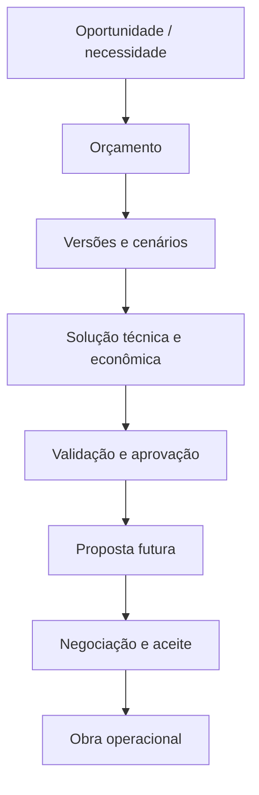
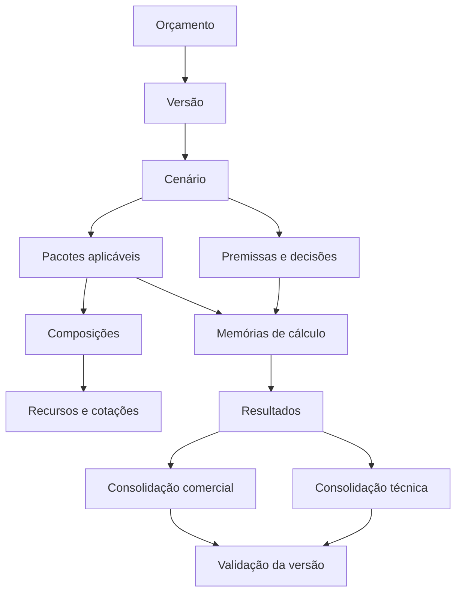

# Domínio Oficial de Orçamentos

Data de consolidação: 2026-07-14

Status: modelo conceitual oficial do domínio de Orçamentos. Documento tecnológico-neutro; não define persistência, código ou interface.

## 1. Autoridade e relação com documentos anteriores

Este documento encerra a fase de descoberta iniciada pela AUDIT_052 e consolida o conhecimento registrado em:

- auditoria homologada do domínio legado;
- estratégia da Fase 2 e fundação provisória do novo sistema;
- Método FOS provisório;
- vocabulário oficial;
- 49 análises individuais;
- crosscheck estrutural dos 49 modelos;
- crosscheck semântico do lote piloto;
- cinco documentos de família;
- parking lot oficial de geração de propostas.

O documento `22_NOVO_SISTEMA_ORCAMENTOS.md` permanece como registro da fundação e das decisões de transição do legado. Este documento passa a ser a referência oficial para o **modelo conceitual** do domínio. Em caso de divergência conceitual, esta consolidação prevalece; decisões de implementação continuam fora do seu escopo.

## 2. Objetivo do domínio

O domínio de Orçamentos existe para transformar uma oportunidade e seu escopo conhecido em uma decisão técnica, econômica e comercial rastreável.

Ele deve permitir que a FOS:

- identifique o objeto a ser cotado;
- registre premissas, incertezas, responsabilidades e exclusões;
- modele uma ou mais soluções/cenários;
- dimensione produção, prazo, equipamentos, estruturas e consumos quando aplicáveis;
- organize o trabalho em pacotes técnicos/econômicos;
- forme custos por composições auditáveis;
- aplique decisões comerciais sem confundi-las com custo técnico;
- validar coerência, completude e riscos;
- comparar cenários;
- preservar versões reproduzíveis;
- produzir consolidações técnicas e comerciais;
- servir futuramente como fonte oficial para propostas e para a transição controlada a uma obra.

O domínio não substitui o julgamento do engenheiro. Ele preserva evidência, apresenta sugestões, executa regras determinísticas conhecidas e registra as decisões adotadas.

## 3. Limites do domínio

### 3.1 Dentro do domínio

- identidade e ciclo do orçamento;
- versões e cenários;
- classificação por família;
- premissas físicas, operacionais, técnicas e comerciais;
- valores informados, sugeridos, adotados e calculados;
- etapas, pacotes, composições, itens e recursos;
- fórmulas, dependências e memórias de cálculo;
- cotações e fotografias de referências usadas;
- responsabilidades, inclusões, exclusões e entregáveis;
- produção, prazo, dimensionamentos, quantidades e consumos;
- custos, preços, incidências comerciais e resultados;
- validações, alertas, decisões e histórico;
- consolidação técnica e comercial;
- vínculo conceitual com a proposta futura.

### 3.2 Fora do domínio, mas relacionado

- prospecção, contatos e interações de CRM;
- execução e gestão operacional da obra;
- medição realizada e custos realizados;
- compras, contratação e pagamento de fornecedores;
- folha de pagamento e gestão de pessoas;
- contabilidade e apuração fiscal oficial;
- geração física, envio e assinatura de documentos de proposta;
- armazenamento físico, tecnologia, interface e integrações.

O orçamento pode referenciar cliente/oportunidade e futuramente originar proposta ou obra, mas essas entidades mantêm identidade e ciclo próprios. Orçamento aprovado não é automaticamente obra operacional.

## 4. Fronteiras e transições conceituais



- A oportunidade fornece contexto; não determina silenciosamente premissas.
- O orçamento contém a engenharia e a formação econômica.
- Uma versão aprovada é a fonte para uma proposta futura.
- Negociação que altera escopo, quantidade, prazo ou preço relevante exige nova versão rastreável.
- O aceite pode autorizar uma transição a obra, sem fundir as identidades.

## 5. Fluxo conceitual completo

1. **Identificar o orçamento:** cliente/oportunidade de referência, objeto, local, finalidade, responsável e família inicial.
2. **Criar uma versão de trabalho:** fotografia coerente do estado do orçamento.
3. **Definir um ou mais cenários:** alternativas de tecnologia, quantidade de equipamentos, turnos, responsabilidades, prazo ou condição comercial.
4. **Registrar premissas e origens:** informações do cliente, medições, cotações, catálogos, históricos, políticas e decisões do engenheiro.
5. **Definir aplicabilidade:** selecionar etapas/pacotes aplicáveis, não aplicáveis e pendentes, preservando motivo e responsabilidade.
6. **Executar submodelos técnicos:** produção, prazo, balanço massa/volume, linha de recalque, dimensionamento de bags/células, capacidade de centrífugas, batimetria ou outros aplicáveis.
7. **Formar pacotes e composições:** recursos, quantidades, unidades, incidências, preços/custos e dependências.
8. **Calcular resultados intermediários:** quantidades, consumos, custos horários/diários/mensais, custos por pacote e totais.
9. **Aplicar decisões comerciais:** BDI, markup, margem, desconto, contingência, faturamento mínimo ou condições por fase, cada qual com significado e base explícitos.
10. **Consolidar:** resumo técnico interno, itens comerciais, unidades econômicas, preços unitários/totais, prazo e responsabilidades.
11. **Validar:** completude, unidade, vigência, dependências, consistência matemática, dupla incidência, limites técnicos e exceções.
12. **Comparar cenários:** diferenças de premissas, custos, preços, capacidade, prazo, risco e resultado.
13. **Revisar e decidir:** registrar escolhas, justificativas, ressalvas e pendências.
14. **Aprovar/congelar uma versão:** tornar o conjunto reproduzível e impedir alteração silenciosa.
15. **Disponibilizar para proposta futura:** expor somente informações aprovadas e rastreáveis, sem redigitação ou invenção.

O fluxo é lógico, não uma sequência obrigatória de telas. Pacotes podem depender de resultados de outros pacotes e serem elaborados em ordem diferente, desde que as dependências e validações sejam respeitadas.

## 6. Visão conceitual das relações



## 7. Entidades e conceitos principais

### 7.1 Orçamento

Identidade estável do processo orçamentário. Representa o problema/objeto cotado e agrupa versões. Não contém sozinho uma fotografia reproduzível: essa responsabilidade pertence à versão.

Responsabilidades conceituais:

- identidade, finalidade e contexto;
- vínculo de referência com cliente/oportunidade;
- família principal e possíveis capacidades adicionais;
- ciclo geral e autoria responsável;
- conjunto de versões.

### 7.2 Versão do orçamento

Fotografia reproduzível de entradas, decisões, referências, cálculos, resultados, validações e consolidações em um momento.

Regras:

- possui identidade e número/revisão próprios;
- referencia sua versão anterior quando derivada;
- versão emitida/aprovada não é reescrita silenciosamente;
- alteração relevante gera nova versão;
- preserva fotografias de catálogos, cotações e parâmetros usados;
- pode conter um ou mais cenários;
- identifica qual cenário foi adotado para consolidação/aprovação.

### 7.3 Cenário

Alternativa coerente dentro de uma versão. Permite comparar soluções sem sobrescrever premissas ou resultados anteriores.

Pode variar:

- família/tecnologia aplicável;
- quantidade/configuração de equipamentos;
- turnos, jornada e produção;
- responsabilidades;
- pacotes;
- prazo;
- unidade/modalidade de cobrança;
- incidências comerciais e fases contratuais.

Um cenário deve ser internamente consistente. Valores de cenários diferentes não podem ser somados ou comparados sem unidade/base compatível.

### 7.4 Família de orçamento

Classificação conceitual que identifica objetivo técnico/econômico e padrões de pacotes/regras. As famílias oficiais atuais são:

- bags, geotêxteis e paliçada/bacia;
- dragagem com centrífuga;
- dragagem e bombeamento direto;
- batimetria e levantamentos;
- composições, equipamentos e equalizações.

Família orienta sugestões e aplicabilidade; não impõe template rígido nem impede combinação de capacidades.

### 7.5 Etapa

Unidade lógica de elaboração ou validação. Organiza o trabalho, mas não é a unidade econômica principal. Uma etapa pode consumir/produzir informações de vários pacotes.

### 7.6 Pacote

Bloco técnico/econômico ativável que reúne finalidade, aplicabilidade, responsabilidades, composições, resultados e dependências.

Exemplos: mobilização, canteiro, preparo de célula, dragagem, bags, centrífuga, polímero, medição, transporte e desmobilização.

Regras:

- possui estado de aplicabilidade explícito;
- não aplicável não é excluído fisicamente;
- pode ser reativado, preservando histórico;
- possui dependências e consumidores conhecidos;
- custo técnico e apresentação comercial podem ter granularidades diferentes;
- responsabilidade do cliente não elimina a necessidade técnica do pacote/item.

### 7.7 Composição

Formação auditável do custo/preço de um item, recurso ou pacote.

Uma composição articula:

- itens/recursos;
- quantidades e unidades;
- incidências únicas, horárias, diárias, mensais, produtivas ou percentuais;
- valores de referência e adotados;
- fórmulas e resultados;
- origem e vigência;
- custos, incidências comerciais e preço separados.

Composição reutilizável é referência; a versão do orçamento preserva a fotografia efetivamente usada.

### 7.8 Item

Elemento quantificável ou apresentável em composição, pacote ou consolidação. Pode ser técnico, econômico ou comercial. Um item comercial pode consolidar vários itens/pacotes técnicos, desde que o vínculo permaneça rastreável.

### 7.9 Recurso

Mão de obra, equipamento, material, insumo, serviço de terceiro, logística ou despesa consumida por uma composição. Possui identidade, categoria, unidade e condições de uso; seu preço no orçamento é uma fotografia contextual, não leitura viva do cadastro mestre.

### 7.10 Premissa e parâmetro

- **Premissa:** entrada assumida/confirmada para cálculo ou decisão.
- **Parâmetro:** grandeza utilizada por regra ou decisão.

Ambos devem registrar valor, unidade, origem, aplicabilidade e condição. Devem distinguir valor informado pelo cliente, sugerido, adotado, histórico e calculado.

### 7.11 Cotação e fotografia de referência

- **Cotação:** evidência comercial datada com fornecedor, escopo, unidade, preço e condição.
- **Fotografia:** referência preservada pela versão, imune a alterações futuras do cadastro/cotação de origem.

### 7.12 Responsabilidade, inclusão, exclusão e entregável

- **Responsabilidade:** parte que fornece, executa ou custeia algo.
- **Inclusão:** conteúdo contemplado no escopo/preço.
- **Exclusão:** conteúdo explicitamente fora do escopo/preço.
- **Entregável:** resultado/documento/bem que deve ser fornecido.

Esses conceitos não podem existir apenas como inferência de valor zero ou texto comercial final.

### 7.13 Validação e decisão

- **Validação:** confirmação, alerta ou bloqueio sobre entrada, cálculo, dependência ou versão.
- **Decisão:** escolha humana entre alternativas, com autor, momento e justificativa disponível.

## 8. Memória de cálculo

A memória de cálculo é a explicação reproduzível de como um resultado foi obtido.

Para cada resultado relevante, deve preservar:

- significado e unidade;
- fórmula/regra conceitual;
- versão da regra quando aplicável;
- entradas e valores usados;
- origem das entradas;
- resultados intermediários;
- dependências;
- arredondamentos;
- aplicabilidade;
- alertas/validações;
- momento ou contexto do cálculo.

A memória não é uma lista opaca de referências de células. Deve ser compreensível em linguagem de domínio, por exemplo:

```text
produção_mensal = vazão_operacional × eficiência × concentração × horas_produtivas_mês
```

Quando a definição de uma variável variar por família, sua base/unidade deve acompanhar a regra.

## 9. Resultados e consolidações

### 9.1 Resultados técnicos

Podem incluir produção, prazo, massa seca, volume desaguado, quantidade de bags, área de célula, capacidade de centrífugas, horas, consumo, distância, quantidade de amostras e dimensionamentos.

### 9.2 Resultados econômicos

Podem incluir custo unitário, horário, diário, mensal, por pacote, por fase e total; custos diretos/indiretos; manutenção; depreciação; juros e contingência.

### 9.3 Resultados comerciais

Podem incluir preço unitário/total, BDI, markup, margem, desconto, faturamento mínimo, resultado por fase e condições do cenário.

### 9.4 Consolidação técnica

Visão interna que preserva pacotes, quantidades, dependências, custos, riscos, premissas e responsabilidades.

### 9.5 Consolidação comercial

Visão simplificada por itens comerciais, unidades, quantidades, preços e condições. Não pode apagar o vínculo com a memória técnica nem expor custos internos indevidos.

## 10. Proposta futura

A proposta técnica/comercial é um domínio relacionado, ainda em parking lot. O orçamento aprovado será sua fonte oficial.

O domínio de Orçamentos deve preservar desde já:

- descrição técnica e comercial dos pacotes/itens;
- metodologia;
- premissas;
- responsabilidades;
- inclusões e exclusões;
- entregáveis;
- condições e observações aprovadas;
- vínculo entre composição técnica e item comercial;
- textos reutilizáveis e sua origem;
- versão/cenário aprovados.

Regras consolidadas para a evolução futura:

- não redigitar informação já estruturada;
- não inventar preço, equipamento, produtividade, prazo, escopo ou responsabilidade;
- preservar versões da proposta e vínculo com a versão do orçamento;
- exigir revisão/aprovação humana antes do envio;
- separar material interno do conteúdo externo;
- tratar modelos históricos como referências, não templates oficiais automáticos.

Formato, tecnologia, automação e uso específico de IA permanecem adiados.

## 11. Regras universais do domínio

Estas regras foram consolidadas como transversais às famílias:

1. Todo orçamento possui identidade independente de suas versões.
2. Toda versão aprovada/emitida deve ser reproduzível e não pode ser sobrescrita silenciosamente.
3. Alteração relevante após aprovação gera nova versão.
4. Cenários alternativos coexistem sem apagar uns aos outros.
5. Toda grandeza usada em cálculo deve possuir significado e unidade.
6. Valor informado, histórico, sugerido, adotado e calculado são conceitos distintos.
7. Cadastro mestre não substitui a fotografia usada pela versão.
8. Custo, preço, BDI, markup, margem, desconto e contingência são conceitos distintos.
9. Zero real, não aplicável, responsabilidade do cliente e pendente são estados distintos.
10. Pacote não aplicável é preservado e excluído somente dos cálculos dependentes de sua execução.
11. Responsabilidade externa não elimina a dependência técnica.
12. Todo resultado relevante deve possuir memória de cálculo e dependências rastreáveis.
13. Arredondamento deve ser explícito e preservar o valor anterior à regra.
14. Consolidação comercial deriva da memória técnica e mantém vínculo com ela.
15. Cotação/preço/parâmetro temporal deve preservar origem e vigência.
16. Erro de fórmula ou inconsistência deve ser registrado; não pode ser normalizado silenciosamente.
17. Regra observada em uma família/modelo não é universal sem evidência transversal e decisão documentada.
18. Sugestão do sistema não substitui decisão do engenheiro.
19. Apenas resultados dependentes de uma alteração devem ser invalidados/recalculados.
20. Correção matemática sem rastreabilidade, continuidade ou desempenho adequado não conclui a homologação funcional.

## 12. Regras específicas por família

### 12.1 Bags, geotêxteis e paliçada/bacia

- distinguir volume in situ, massa seca e volume desaguado;
- dimensionar contenção pela capacidade adotada, área e arranjo;
- tratar célula/paliçada, bags e polímero como pacotes ativáveis;
- registrar responsabilidade por água, energia, área, descarga e destinação;
- arredondar quantidade de bags/células somente por regra explícita;
- validar capacidade, sólidos, área disponível e dosagem.

### 12.2 Centrífuga

- separar capacidade nominal, operacional, informada pelo cliente e adotada;
- verificar gargalo entre draga e centrífugas;
- suportar quantidade de máquinas, turnos e fases contratuais;
- distinguir custos de implantação/recuperação inicial dos recorrentes;
- suportar tonelada seca, mês e faturamento mínimo;
- validar vida útil, utilização e dupla incidência de custos iniciais.

### 12.3 Dragagem e bombeamento direto

- distinguir horas disponíveis, trabalhadas e produtivas;
- modelar linha de recalque e booster quando aplicáveis;
- separar prazo técnico do prazo custeado;
- suportar cobrança por m³, mês, hora ou disponibilidade;
- manter mobilização, operação, medição e desmobilização independentes.

### 12.4 Batimetria e levantamentos

- produção de draga não é obrigatória;
- geometria, método, precisão, amostragem e entregáveis orientam o escopo;
- suportar preço por verba, m², ponto, amostra, visita ou combinação;
- separar serviço de terceiro, acompanhamento FOS, laboratório e projeto;
- validar área/quantidade zero, plano técnico e escopo da cotação.

### 12.5 Composições, equipamentos e equalizações

- composição reutilizável não é orçamento completo;
- suportar configuração com/sem equipe, combustível, manutenção e operador;
- incidência pode ser única, horária, diária, mensal ou produtiva;
- equalização compara alternativas e não cria automaticamente regra de cálculo;
- incorporação de composição deve evitar dupla contagem de recursos;
- modelos ainda não analisados integralmente não podem ser promovidos a padrão.

## 13. Princípios de desempenho e experiência

Desempenho percebido e continuidade fazem parte do comportamento correto do domínio.

Princípios obrigatórios:

- carregar listagens por resumo, sem trazer detalhes de todos os orçamentos;
- carregar detalhes, pacotes e memórias somente quando necessários;
- reutilizar com segurança referências já carregadas;
- possuir invalidação explícita para dados e resultados reaproveitados;
- recalcular apenas descendentes afetados no grafo de dependências;
- não reler catálogos invariáveis ao alternar etapas/cenários;
- evitar leituras externas idênticas na mesma operação/renderização;
- persistir sem perder orçamento, versão, cenário, etapa, seleção ou posição;
- informar operações demoradas e seu estado;
- evitar recarregamentos integrais, piscadas e esperas evitáveis;
- tratar qualquer mecanismo de reinício integral como excepcional, motivado e testado;
- medir tempo percebido, leituras externas, invalidações e recálculos em mudanças de risco.

Critérios conceituais de aceite:

1. abrir painel sem carregar todas as memórias;
2. alternar etapas sem reler referências não invalidadas;
3. editar premissa sem recalcular pacotes independentes;
4. salvar preservando continuidade de contexto;
5. não repetir leitura idêntica durante uma mesma interação;
6. distinguir processamento necessário de espera evitável.

Esses princípios permanecem válidos independentemente da tecnologia escolhida.

## 14. Rastreabilidade obrigatória

Deve ser possível responder, para qualquer resultado ou decisão relevante:

- qual orçamento, versão e cenário o produziram;
- qual família/pacote/composição o contém;
- quais entradas e unidades foram usadas;
- quais valores eram informados, sugeridos e adotados;
- qual foi a origem/vigência de cada referência;
- qual fórmula e arredondamento foram aplicados;
- quais dependências foram percorridas;
- quem alterou, validou ou aprovou;
- quais alertas, exceções ou pendências existiam;
- qual item comercial deriva do resultado;
- qual proposta futura usou essa versão.

Nenhum resultado crítico deve depender apenas de estado transitório, texto livre sem estrutura ou referência externa mutável.

## 15. Decisões consolidadas

- O alvo de equivalência é o conhecimento válido dos Excel, não o fluxo legado.
- Dados e conhecimento úteis são preservados; funcionalidades legadas não são protegidas sem benefício comprovado.
- O domínio é orientado a versões, cenários, pacotes, composições e memórias de cálculo.
- Famílias orientam regras específicas sem fragmentar o núcleo comum.
- Aplicabilidade e responsabilidade são explícitas.
- A unidade econômica não é universal: m³, t seca, m², mês, hora e verba são válidos conforme o contrato.
- Produção/prazo não é etapa obrigatória para toda família.
- O engenheiro decide; histórico/catálogos sugerem e regras determinísticas calculam.
- Cadastro mestre e fotografia de versão são separados.
- Resumo técnico e comercial são representações distintas e vinculadas.
- A proposta futura nasce de versão aprovada, sem redigitação e com revisão humana.
- Desempenho, estabilidade visual e continuidade integram a homologação.
- A transição a obra é explícita e não funde orçamento com obra operacional.

## 16. Decisões adiadas — parking lot

### 16.1 Modelagem de dados e tecnologia

- representação física, persistência e identidade técnica;
- tecnologia de cálculo, invalidação e cache;
- integrações, permissões físicas e formato de armazenamento;
- estratégia de migração do legado.

### 16.2 Ciclo e governança

- estados finais de orçamento, versão, cenário e aprovação;
- papéis, alçadas e segregação de custos/margens;
- critérios de bloqueio para emissão;
- política de revisão após negociação/aceite.

### 16.3 Engenharia

- valores corporativos aprovados de eficiência, concentração, encargos, manutenção, vidas úteis e juros;
- regras oficiais de arredondamento por família/pacote;
- capacidade útil de bags e dimensionamento de células;
- dimensionamento de centrífugas e critérios de gargalo;
- planos de batimetria/amostragem e precisão;
- universalização de fórmulas ainda não validada.

### 16.4 Comercial

- política oficial de BDI, markup, margem, desconto e contingência;
- impostos e regime fiscal;
- faturamento mínimo e contratos por fase;
- validade de cotações e reajustes;
- modalidade de cobrança preferida por família.

### 16.5 Propostas futuras

- tecnologia e formatos de geração;
- biblioteca/templates oficialmente aprovados;
- uso de IA e controles específicos;
- fluxo de revisão, emissão, envio e assinatura;
- política de textos reutilizáveis e idiomas.

### 16.6 Conhecimento pendente

- aprofundamento semântico dos 44 modelos restantes;
- conversão controlada do modelo legado `.xls`;
- confronto com custos/produções realizados;
- homologação das perguntas abertas registradas nas famílias/análises.

Itens no parking lot não podem ser assumidos pela futura modelagem de dados sem decisão própria.

## 17. Critérios de suficiência do modelo conceitual

Um desenvolvedor deve compreender, sem abrir Excel:

- o que é um orçamento e como versões/cenários se relacionam;
- como premissas viram cálculos, pacotes, custos e preços;
- por que famílias variam sem romper o núcleo comum;
- como composições e memórias preservam explicabilidade;
- como custo técnico se transforma em consolidação comercial;
- como responsabilidades, aplicabilidade, unidades e origens evitam ambiguidades;
- como uma versão aprovada pode originar proposta e, após aceite, relacionar-se a obra;
- quais regras são oficiais e quais permanecem adiadas.

## 18. Encerramento da descoberta

A descoberta baseada nos 49 modelos está encerrada para fins de modelagem conceitual inicial. Este encerramento não declara que toda fórmula histórica seja correta ou universal; declara que o conhecimento disponível foi organizado em um domínio coerente, com fronteiras, conceitos, regras, exceções e decisões adiadas explícitos.

Próxima etapa permitida somente após homologação do Merlin: modelagem de dados derivada deste domínio, sem reabrir decisões adiadas por suposição.
