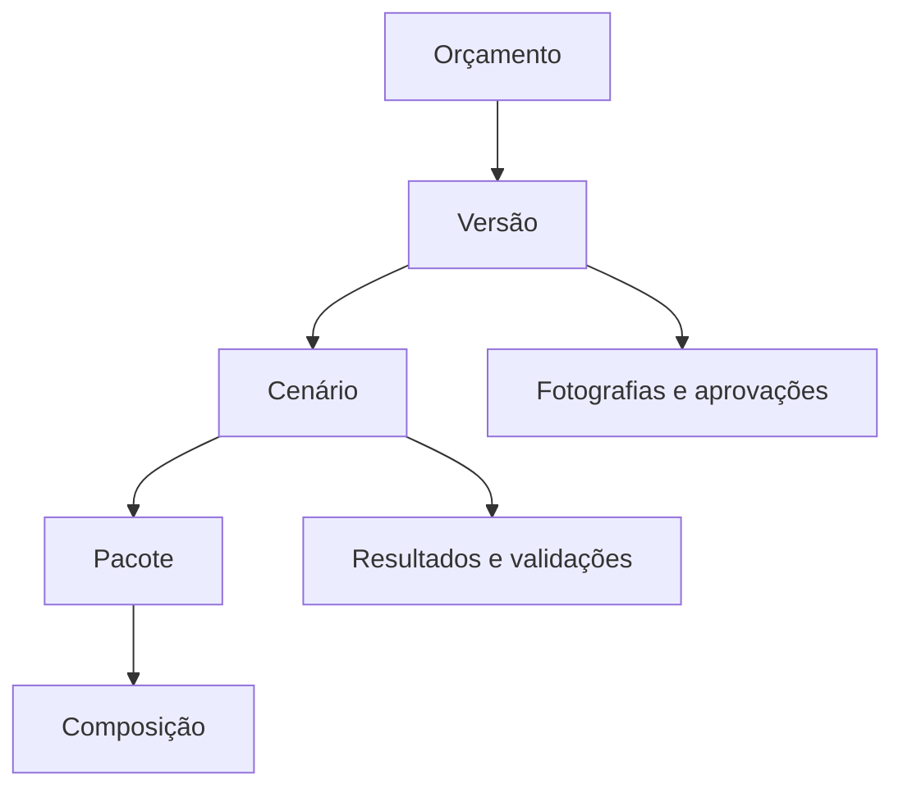
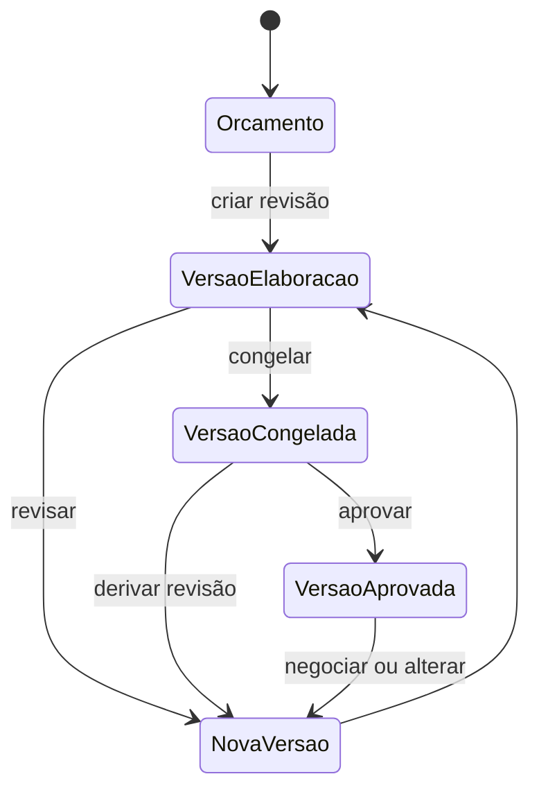
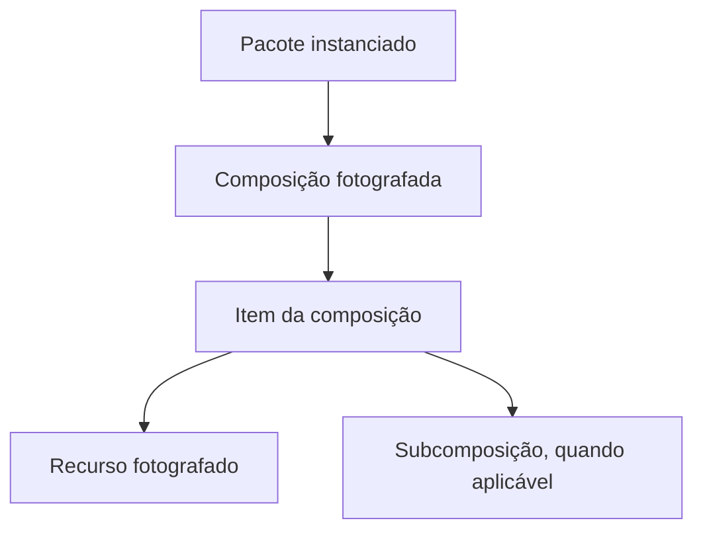
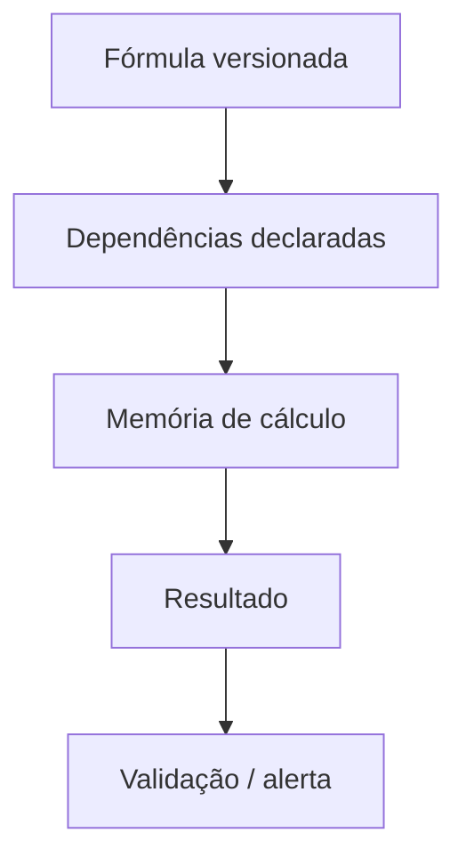
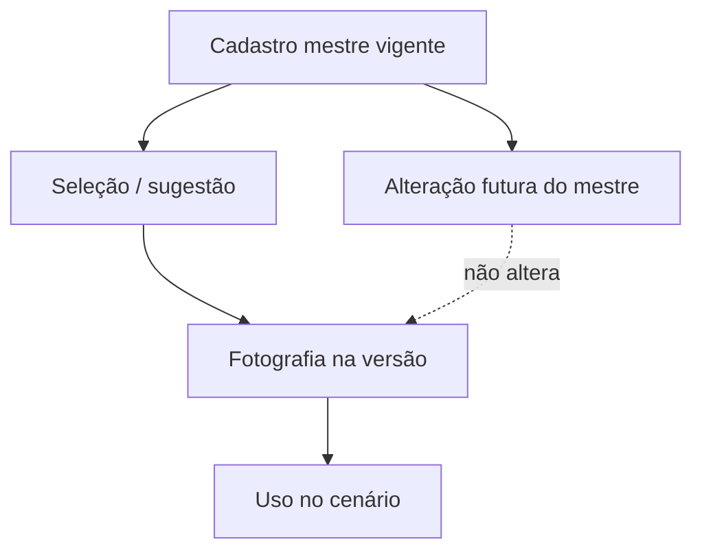
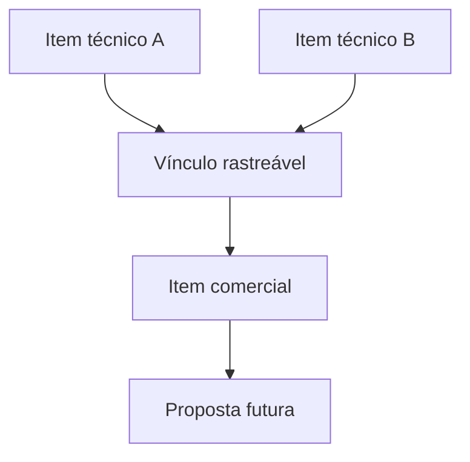

# Modelo Lógico de Dados do Domínio de Orçamentos

Data: 2026-07-14

Status: modelo lógico oficial, tecnológico-neutro e sem implementação.

## 1. Autoridade, objetivo e natureza

Este documento deriva exclusivamente do domínio oficial em `22_DOMINIO_ORCAMENTOS.md`, do vocabulário, do Método FOS, do crosscheck semântico, do parking lot de propostas e dos documentos das famílias.

Seu objetivo é definir estruturas lógicas de informação, identidades, propriedade, relacionamentos, cardinalidades, invariantes, ciclos de vida, versionamento e rastreabilidade. Não define formato físico de identificadores, persistência, classes, rotas, arquivos, componentes ou tecnologia.

O modelo permanece válido independentemente do meio físico futuro. Termos como entidade, atributo e relacionamento expressam semântica do domínio, não estruturas físicas.

## 2. Princípios estruturais

1. Identidade lógica não depende exclusivamente de nome textual.
2. Orçamento mantém identidade entre revisões; cada versão possui identidade própria.
3. Cenário pertence a exatamente uma versão e não mistura resultados de outro cenário.
4. Conteúdo aprovado/congelado não é sobrescrito silenciosamente.
5. Cadastro mestre e fotografia usada pela versão são entidades distintas.
6. Recurso mestre e recurso fotografado são distintos.
7. Cotação original e fotografia da cotação são distintas.
8. Composição reutilizável e composição instanciada/fotografada são distintas.
9. Valor informado, sugerido, adotado, calculado e histórico são semanticamente distintos.
10. Estado semântico não é codificado por um zero ambíguo.
11. Todo valor calculado relevante possui memória reproduzível.
12. Resultado congelado preserva regra, entradas, unidades e dependências usadas.
13. Pacote é bloco técnico/econômico, nunca tela ou aba.
14. Item comercial mantém vínculo com os itens técnicos que o sustentam.
15. Relações externas com cliente, proposta e obra são referências, não fusão de identidades.
16. Exclusão lógica/inativação preserva histórico quando houver uso anterior.
17. Recalculo e invalidação seguem dependências, não o orçamento inteiro por padrão.

## 3. Níveis de propriedade

```text
Orçamento
└── Versão
    ├── Cenários
    │   ├── Etapas
    │   ├── Pacotes e aplicabilidades
    │   │   └── Composições
    │   │       └── Itens e recursos fotografados
    │   ├── Premissas, parâmetros e valores
    │   ├── Memórias, resultados, validações e decisões
    │   └── Itens comerciais
    ├── Fotografias de referências
    ├── Aprovações
    └── Histórico
```

Regra de propriedade: informação que influencia reprodução técnica, econômica ou comercial pertence à versão ou a um descendente dela. O Orçamento conserva apenas identidade e contexto estáveis entre revisões.

## 4. Diagramas conceituais obrigatórios

### 4.1 Relações principais



### 4.2 Ciclo Orçamento → Versão → Cenário



Cada versão contém cenários próprios. Somente uma versão aprovada indica um cenário adotado, salvo decisão explícita de não adoção.

### 4.3 Pacote → Composição → Item → Recurso



### 4.4 Fórmula → Dependência → Memória → Resultado



### 4.5 Cadastro mestre → Fotografia da versão



### 4.6 Item técnico → Item comercial



Um item técnico pode sustentar vários itens comerciais e um item comercial pode consolidar vários itens técnicos.

## 5. Perfis lógicos das entidades

As tabelas desta seção, combinadas com as matrizes de relacionamento e ciclo de vida, registram para cada entidade: finalidade, identidade, atributos, proprietário, versionamento, rastreabilidade, natureza mestre/fotografia/transação/calculada e pendências permitidas.

### 5.1 Identidade, versão e organização

| Entidade | Finalidade e identidade lógica | Proprietário | Atributos mínimos | Opcionais / pendências | Natureza e versionamento |
|---|---|---|---|---|---|
| **Orçamento** | Identidade estável do processo cotado | Próprio | identidade, objeto, finalidade, responsável, situação geral, criação | referência externa, família inicial, observação | Transação raiz; não versiona sua identidade; contexto mutável só quando não altera reprodução |
| **Versão do Orçamento** | Fotografia coerente de uma revisão | Orçamento | identidade, número/revisão, origem, estado, autor, momento | motivo, versão anterior, cenário adotado | Transação versionada; editável em elaboração; imutável após congelamento/aprovação |
| **Cenário** | Alternativa coerente dentro da versão | Versão | identidade, nome descritivo, estado, origem, ordem | justificativa, cenário de origem, resumo comparativo | Fotografia da versão; pode ser duplicado com nova identidade; descartado é preservado |
| **Família** | Classifica padrões técnicos/econômicos | Catálogo mestre de conhecimento | identidade, nome oficial, objetivo, estado | regras/pacotes sugeridos, vigência | Mestre versionável; cenário preserva a família adotada/fotografada |
| **Etapa** | Organiza elaboração/validação lógica | Cenário | identidade, conceito, ordem lógica, estado | dependências, conclusão, responsável | Transação do cenário; não equivale a tela; pode ficar pendente |
| **Referência a Cliente/Oportunidade** | Vincula contexto externo sem fundir identidade | Orçamento | identidade lógica da referência, origem, tipo, identidade externa | descrição fotografada, contato/contexto | Referência externa; versão pode preservar descrição contextual |
| **Referência futura a Proposta** | Indica proposta originada por versão aprovada | Versão | identidade da referência, versão/cenário de origem, estado conhecido | revisão/data da proposta | Referência externa futura; não existe obrigatoriamente |
| **Referência futura a Obra** | Indica obra relacionada após aceite/transição | Orçamento ou versão aprovada | identidade da referência, origem e momento do vínculo | proposta/aceite de origem | Referência externa futura; orçamento e obra permanecem distintos |

### 5.2 Pacotes, composições, itens e recursos

| Entidade | Finalidade e identidade lógica | Proprietário | Atributos mínimos | Opcionais / pendências | Natureza e versionamento |
|---|---|---|---|---|---|
| **Pacote** | Instância de bloco técnico/econômico | Cenário | identidade, tipo/conceito, nome adotado, ordem, estado | descrição técnica/comercial, direcionador | Transação/fotografia do cenário; não é mestre nem interface |
| **Aplicabilidade do Pacote** | Decide se pacote participa do cenário | Pacote | identidade, estado semântico, autor, momento | motivo, condição, dependências afetadas | Decisão versionada no cenário; histórico obrigatório; não aplicável não apaga pacote |
| **Composição** | Formação auditável de custo/preço | Pacote ou item superior | identidade, finalidade, versão/origem, unidade de saída | composição mestre de origem, observação | Instância fotografada; mestre reutilizável é distinto; congelada com versão |
| **Item da Composição** | Linha técnica/econômica da composição | Composição | identidade, descrição, ordem, natureza, unidade, incidência | recurso, subcomposição, direcionador, responsabilidade | Transação fotografada; quantidade/valor podem ficar pendentes em elaboração |
| **Recurso** | Objeto consumido pelo item | Catálogo mestre ou fotografia da versão | identidade, descrição, categoria, unidade padrão, estado | especificação, fornecedor preferencial, vigência | Mestre quando reutilizável; uso na versão exige fotografia distinta |
| **Categoria de Recurso** | Classifica semântica do recurso | Catálogo mestre | identidade, nome, regras de unidade/incidência, estado | hierarquia, descrição | Mestre versionável; mudança não recategoriza fotografias antigas |
| **Unidade de Medida** | Define grandeza e compatibilidade | Catálogo mestre | identidade, símbolo, grandeza, estado | fator/convenção de conversão, precisão | Mestre versionável; símbolo textual não é identidade; unidade usada é fotografada |

### 5.3 Premissas, parâmetros e valores

| Entidade | Finalidade e identidade lógica | Proprietário | Atributos mínimos | Opcionais / pendências | Natureza e versionamento |
|---|---|---|---|---|---|
| **Premissa** | Entrada assumida/confirmada que condiciona o cenário | Versão ou cenário, conforme escopo | identidade, conceito, valor semântico, unidade, origem, estado | validade, evidência, responsável, justificativa | Transação versionada; pode permanecer pendente; alteração invalida dependentes |
| **Parâmetro** | Grandeza utilizada por regra/decisão | Versão, cenário, pacote ou fórmula | identidade, conceito, unidade esperada, aplicabilidade | faixa, referência mestre, vigência | Definição pode ser mestre; valor usado pertence à versão/cenário |
| **Valor Sugerido** | Referência apresentada para decisão | Premissa/parâmetro/item | identidade, valor/estado, unidade, origem, momento | regra de sugestão, confiança, validade | Derivado ou fotografado; nunca substitui adotado; pode ser recalculado sem reescrever versão congelada |
| **Valor Adotado** | Valor efetivamente escolhido | Premissa/parâmetro/item | identidade, valor/estado, unidade, autor, momento, origem | justificativa, valor sugerido relacionado | Transação da versão; histórico obrigatório quando alterado; congelado com versão |
| **Valor Calculado** | Saída determinística de memória | Memória de Cálculo | identidade, valor/estado, unidade, momento, validade | precisão, arredondamento, processo responsável | Calculado e fotografado; recalculável em elaboração; imutável na fotografia congelada |

### 5.4 Fórmulas, dependências, memórias e resultados

| Entidade | Finalidade e identidade lógica | Proprietário | Atributos mínimos | Opcionais / pendências | Natureza e versionamento |
|---|---|---|---|---|---|
| **Fórmula** | Regra determinística identificada/versionada | Catálogo de regras de domínio | identidade, versão, expressão conceitual, entradas, unidades esperadas, saída | família/pacote, arredondamento, validações, explicação | Mestre versionado; alteração cria nova versão da regra |
| **Dependência de Cálculo** | Declara precedência/impacto entre informação e resultado | Fórmula ou resultado | identidade, origem lógica, destino lógico, tipo de dependência | condição/aplicabilidade, ordem | Definição versionada; instância usada fica registrada na memória |
| **Memória de Cálculo** | Preserva execução reproduzível | Cenário/pacote/composição | identidade, fórmula/versão, entradas fotografadas, unidades, momento, resultado | avisos, dependências, autoria/processo, arredondamento | Transação calculada; nova execução gera nova memória ou substitui somente a vigente em elaboração com histórico |
| **Resultado** | Representa saída técnica, operacional, quantitativa, econômica, comercial ou indicador | Cenário, pacote ou composição | identidade, tipo, conceito, valor calculado/fotografado, unidade, validade | período, escopo, classificação, comparação | Calculado e fotografado; congelado com versão; pode ficar não calculável |

### 5.5 Referências mestres e fotografias

| Entidade | Finalidade e identidade lógica | Proprietário | Atributos mínimos | Opcionais / pendências | Natureza e versionamento |
|---|---|---|---|---|---|
| **Fornecedor** | Identifica fonte comercial externa | Catálogo mestre | identidade estável, nome oficial, estado | contatos, qualificações, observações | Mestre; nome não é identidade; versão preserva dados relevantes via fotografia |
| **Cotação** | Evidência comercial original | Fornecedor/contexto de aquisição | identidade, escopo, unidade, valor, data-base, origem | validade, condição, contato, moeda, anexo/referência | Evidência mestre/histórica; não é alterada retroativamente; correção gera nova evidência |
| **Fotografia de Referência** | Congela dado mestre usado na versão | Versão | identidade, tipo de origem, identidade/versão da origem, descrição, unidade, valor/condição, momento | fornecedor, vigência, observação, categoria | Fotografia imutável após congelamento; pode existir sem valor monetário |

Equipamentos, materiais, salários, insumos, unidades, parâmetros de referência e composições reutilizáveis são especializações conceituais de cadastros mestres/referências; seu uso no orçamento ocorre sempre por fotografia, sem exigir neste modelo uma estrutura física específica para cada especialização.

### 5.6 Escopo, comercial, governança e rastreabilidade

| Entidade | Finalidade e identidade lógica | Proprietário | Atributos mínimos | Opcionais / pendências | Natureza e versionamento |
|---|---|---|---|---|---|
| **Responsabilidade** | Registra quem fornece/executa/custeia | Versão, cenário, etapa, pacote ou item | identidade, parte responsável, objeto, tipo, estado | impactos técnico/econômico/comercial, origem, texto futuro | Transação versionada; não inferida de zero |
| **Inclusão** | Declara conteúdo incluído no escopo/preço | Versão/cenário/pacote/item | identidade, objeto, descrição, origem, estado | impactos, texto de proposta | Transação versionada e aprovável |
| **Exclusão** | Declara conteúdo fora do escopo/preço | Versão/cenário/pacote/item | identidade, objeto, descrição, origem, estado | responsabilidade externa, impactos, texto de proposta | Transação versionada; não apaga necessidade técnica |
| **Entregável** | Define resultado devido | Versão/cenário/pacote | identidade, descrição, responsável, estado | formato conceitual, prazo, critério de aceite | Transação versionada e aprovável |
| **Item Comercial** | Unidade de apresentação/cobrança | Cenário/consolidação comercial | identidade, descrição, unidade econômica, quantidade, preço/estado | ordem, texto, condição, agrupamento | Transação fotografada; vínculo N:N com itens técnicos obrigatório |
| **Incidência Comercial** | Representa BDI, markup, margem, desconto, contingência ou outra incidência | Cenário, pacote ou item comercial | identidade, tipo, base, valor/estado, unidade, origem | vigência, justificativa, ordem de aplicação | Transação versionada; tipo não pode ser ambíguo; calculada quando derivada |
| **Validação** | Avalia consistência/completude | Versão/cenário ou objeto específico | identidade, regra, objeto, severidade, estado, mensagem, momento | evidência, justificativa, responsável/resolução | Transação reproduzível; regra pode ser mestre, ocorrência pertence à versão |
| **Alerta** | Comunicação contextual não necessariamente bloqueante | Validação/objeto | identidade, severidade, mensagem, estado, origem | evidência, ação sugerida, resolução | Ocorrência transacional; preservada quando relevante à aprovação |
| **Decisão** | Registra escolha humana | Versão/cenário ou objeto decidido | identidade, questão, opção adotada, autor, momento | alternativas, justificativa, evidências | Transação imutável como evento; nova decisão substitutiva referencia anterior |
| **Histórico de Alteração** | Registra mudança auditável | Entidade alterada/versão | identidade, objeto, ação, autor/processo, momento, antes/depois semântico | motivo, correlação, origem | Registro imutável; não é editado nem excluído |
| **Aprovação** | Registra julgamento formal | Versão ou objeto aprovável | identidade, escopo, decisão, aprovador, momento | ressalvas, validade, nível | Registro imutável; revogação/nova aprovação gera novo registro |

### 5.7 Enquadramento dos demais conceitos oficiais

Os termos oficiais abaixo não exigem, por si, entidade independente. São classificações, especializações ou propriedades das entidades já definidas. Suas definições permanecem as do `VOCABULARIO_ORCAMENTOS.md`.

| Conceitos oficiais | Enquadramento lógico |
|---|---|
| **Modelo de origem**, **Evidência**, **Interpretação**, **Hipótese**, **Exceção** | origem/evidência/estado de conhecimento associado a Fotografia, Premissa, Decisão, Validação ou Família |
| **Família de orçamento**, **Núcleo comum**, **Regra da família** | Família e versões de regras/fórmulas aplicáveis |
| **Submodelo**, **Grafo de dependências** | conjunto coeso de Fórmulas, Dependências, Memórias e Resultados |
| **Entrada**, **Constante embutida**, **Valor informado pelo cliente**, **Valor histórico**, **Origem**, **Vigência**, **Zero real**, **Pendente** | Premissa/Parâmetro/estrutura de valor e seu estado semântico |
| **Volume in situ**, **Volume de polpa**, **Volume desaguado**, **Massa seca / tonelada seca**, **Teor de sólidos** | conceitos de Premissa, Parâmetro ou Resultado com Unidade e escopo explícitos |
| **Vazão nominal**, **Vazão operacional**, **Eficiência**, **Concentração** | Parâmetros técnicos; nominal/sugerido e operacional/adotado permanecem separados |
| **Horas disponíveis**, **Horas trabalhadas**, **Horas produtivas**, **Produção horária**, **Produção mensal**, **Prazo técnico**, **Prazo custeado** | Premissas/Resultados operacionais, ligados por Memórias de Cálculo |
| **Capacidade nominal**, **Capacidade adotada**, **Gargalo** | Parâmetro/Resultado técnico e Validação de capacidade/dependência |
| **Linha de recalque**, **Barrilete**, **Booster** | tipos de Pacote, Composição, Recurso ou Submodelo conforme granularidade do cenário |
| **Dragagem direta**, **Desaguamento**, **Bag geotêxtil**, **Célula de desaguamento**, **Paliçada/bacia**, **Centrífuga**, **Polímero**, **Dosagem**, **Batimetria**, **Amostragem**, **Medição**, **Destinação** | tipos de Família, Pacote, Recurso, Parâmetro, Resultado ou Entregável; não são telas |
| **Categoria de recurso**, **Unidade**, **Incidência** | Categoria de Recurso, Unidade de Medida e propriedade do Item/Incidência Comercial |
| **Custo unitário**, **Custo mensal**, **Custo total**, **Custo direto**, **Custo indireto**, **Custo fixo**, **Custo variável** | classificações de Resultado econômico com período/base explícitos |
| **Mobilização**, **Desmobilização**, **Canteiro**, **Manutenção**, **Depreciação**, **Juros de capital** | tipos de Pacote, Composição, Incidência ou Resultado econômico conforme o caso |
| **Preço unitário**, **Preço total**, **BDI**, **Markup**, **Margem**, **Desconto**, **Contingência**, **Faturamento mínimo**, **Resultado**, **Fase contratual**, **Unidade econômica** | Incidência Comercial, Item Comercial, Cenário e Resultados comerciais, sem intercambiar significados |
| **Resumo técnico**, **Resumo comercial**, **Exclusão** | consolidações vinculadas e entidade Exclusão |
| **Erro de fórmula**, **Inconsistência**, **Arredondamento** | Validação/Alerta e propriedade explícita da Fórmula/Memória |
| **Cache**, **Invalidação**, **Recalculo incremental**, **Rerun visível**, **Continuidade de contexto** | requisitos lógicos de validade, granularidade, desempenho e experiência; tecnologia permanece adiada |

## 6. Matriz de entidades

`Versionada` indica que alterações relevantes produzem nova versão/fotografia ou pertencem a uma versão do orçamento; não implica mecanismo físico.

| Entidade | Identidade | Proprietário | Versionada | Imutável após aprovação | Mestre/Fotografia/Transação/Calculada |
|---|---|---|---|---|---|
| Orçamento | própria e estável | próprio | não na identidade | não; contexto geral controlado | Transação raiz |
| Versão do Orçamento | própria | Orçamento | sim | sim | Transação/fotografia |
| Cenário | própria | Versão | sim | sim | Transação/fotografia |
| Família | própria | catálogo de conhecimento | sim | fotografia usada, sim | Mestre + fotografia |
| Etapa | própria no cenário | Cenário | sim | sim | Transação |
| Pacote | própria no cenário | Cenário | sim | sim | Transação/fotografia |
| Aplicabilidade do Pacote | própria | Pacote | sim | sim | Decisão/transação |
| Composição | própria | Pacote/composição superior | sim | sim | Mestre opcional + fotografia |
| Item da Composição | própria | Composição | sim | sim | Transação/fotografia |
| Recurso | própria | catálogo mestre | sim | fotografia usada, sim | Mestre + fotografia |
| Categoria de Recurso | própria | catálogo mestre | sim | fotografia usada, sim | Mestre + fotografia |
| Premissa | própria | Versão/Cenário | sim | sim | Transação |
| Parâmetro | própria | escopo de uso | sim | valor usado, sim | Mestre opcional + transação |
| Valor Sugerido | própria | objeto sugerido | por origem/regra | fotografia usada, sim | Derivada/fotografia |
| Valor Adotado | própria | objeto adotante | sim | sim | Transação |
| Valor Calculado | própria | Memória | por execução | sim | Calculada/fotografia |
| Unidade de Medida | própria | catálogo mestre | sim | fotografia usada, sim | Mestre + fotografia |
| Fórmula | própria + versão da regra | catálogo de regras | sim | versão usada, sim | Mestre versionado |
| Dependência de Cálculo | própria | Fórmula/Resultado | sim | instância usada, sim | Mestre + fotografia |
| Memória de Cálculo | própria | Cenário/Pacote/Composição | por execução | sim | Calculada/fotografia |
| Resultado | própria | Cenário/Pacote/Composição | por cálculo | sim | Calculada/fotografia |
| Cotação | própria | contexto/Fornecedor | nova evidência | sim como evidência | Mestre/histórica |
| Fornecedor | própria | catálogo mestre | sim | fotografia usada, sim | Mestre + fotografia |
| Fotografia de Referência | própria | Versão | já é fotografia | sim | Fotografia |
| Responsabilidade | própria | escopo associado | sim | sim | Transação |
| Inclusão | própria | escopo associado | sim | sim | Transação |
| Exclusão | própria | escopo associado | sim | sim | Transação |
| Entregável | própria | Versão/Cenário/Pacote | sim | sim | Transação |
| Item Comercial | própria | Cenário | sim | sim | Transação/fotografia |
| Incidência Comercial | própria | cenário/pacote/item | sim | sim | Transação/calculada |
| Validação | própria | objeto validado | regra/ocorrência | ocorrência, sim | Mestre + transação |
| Alerta | própria | Validação/objeto | por ocorrência | quando aprovado, sim | Transação |
| Decisão | própria | versão/objeto | evento sucessor | sim | Evento/transação |
| Histórico de Alteração | própria | objeto/versão | não; é evento | sempre | Evento imutável |
| Aprovação | própria | objeto aprovável | evento sucessor | sempre | Evento imutável |
| Referência Cliente/Oportunidade | própria | Orçamento | contexto fotografado | fotografia usada, sim | Referência externa |
| Referência futura a Proposta | própria | Versão | externa | sim quanto à origem | Referência externa |
| Referência futura a Obra | própria | Orçamento/Versão | externa | sim quanto à origem | Referência externa |

## 7. Matriz de relacionamentos e cardinalidades

| Origem | Relação | Destino | Cardinalidade | Obrigatória | Regra |
|---|---|---|---|---|---|
| Orçamento | possui | Versão | 1 → N | sim, após início da elaboração | primeira versão inaugura conteúdo reproduzível |
| Versão | deriva de | Versão anterior | N → 0..1 | não | origem preservada; sem ciclos |
| Versão | contém | Cenário | 1 → N | sim | cenário pertence a uma única versão |
| Versão aprovada | adota | Cenário | 1 → 1 | sim na aprovação | cenário deve pertencer à mesma versão e estar válido |
| Versão | classifica/usa | Família | N → 1..N | sim | ao menos família principal; combinações permitidas |
| Cenário | organiza | Etapa | 1 → 0..N | não | etapa não é interface |
| Cenário | contém | Pacote | 1 → N | sim | pacote não é compartilhado entre cenários |
| Pacote | possui | Aplicabilidade | 1 → 1 vigente + N históricas | sim | estado vigente deriva do histórico de decisões |
| Pacote | contém | Composição | 1 → 0..N | não | pacote pode ser descritivo/sem custo ainda |
| Composição | contém | Item da Composição | 1 → N | sim para composição calculável | ordem e identidade próprias |
| Item | referencia | Recurso fotografado | N → 0..1 | não | item pode ser percentual, subcomposição ou descritivo |
| Item | referencia | Subcomposição | N → 0..1 | não | ciclos de composição são proibidos |
| Recurso | pertence | Categoria | N → 1 | sim no mestre | categoria fotografada no uso |
| Recurso | usa unidade padrão | Unidade | N → 1 | sim | item pode adotar unidade compatível diferente |
| Versão | possui | Premissa | 1 → N | sim | premissa global não é duplicada sem motivo no cenário |
| Cenário/Pacote/Item | possui | Parâmetro/Valor Adotado | 1 → 0..N | conforme cálculo | escopo lógico evita ambiguidade |
| Premissa/Parâmetro/Item | recebe | Valor Sugerido | 1 → 0..N | não | múltiplas sugestões preservam origens |
| Premissa/Parâmetro/Item | possui vigente | Valor Adotado | 1 → 0..1 por contexto | quando decidido | histórico contém anteriores |
| Fórmula | declara | Dependência | 1 → N | sim | entradas, unidades e saída identificadas |
| Memória | usa | Fórmula | N → 1 | sim | usa versão exata da fórmula |
| Memória | registra | Dependência usada | N ↔ N | sim | captura dependências efetivamente resolvidas |
| Memória | captura | Valores de entrada | 1 → N | sim | valores/unidades/estados fotografados |
| Memória | produz | Valor Calculado | 1 → 1..N | sim | cada saída identificada |
| Resultado | é sustentado por | Memória | N → 1 | sim se calculado | resultado informado adota outra origem explícita |
| Resultado | depende de | Resultado/Premissa/Parâmetro | N ↔ N | conforme regra | grafo acíclico por execução; dependência condicional explícita |
| Versão | contém | Fotografia de Referência | 1 → N | quando usa mestre | nenhuma leitura viva substitui fotografia histórica |
| Fotografia | deriva de | Recurso/Cotação/Fornecedor/Unidade/Parâmetro/Composição mestre | N → 1 | sim quando há origem mestre | identidade/versão de origem preservada |
| Cotação | pertence a | Fornecedor | N → 1 | sim, salvo fonte excepcional justificada | fornecedor não identificado fica pendente, não inventado |
| Responsabilidade/Inclusão/Exclusão | qualifica | Etapa/Pacote/Item/Versão/Cenário | N → 1 | sim | alvo explícito |
| Entregável | pertence a | Versão/Cenário/Pacote | N → 1 | sim | responsável e aceite podem ficar pendentes em elaboração |
| Item Comercial | sustentado por | Itens técnicos | N ↔ N | sim antes da aprovação | vínculo guarda regra/participação conceitual |
| Incidência Comercial | aplica-se a | Cenário/Pacote/Item Comercial | N → 1 | sim | base e ordem explícitas |
| Validação | avalia | qualquer objeto versionado | N → 1 | sim | ocorrência possui evidência/mensagem |
| Validação | gera | Alerta | 1 → 0..N | não | bloqueio pode existir sem alerta separado |
| Decisão | resolve/seleciona | objeto/questão | N → 1 | sim | decisão substitutiva referencia anterior |
| Histórico | registra | objeto alterado | N → 1 | sim | antes/depois semântico |
| Aprovação | aprova/rejeita | Versão ou objeto aprovável | N → 1 | sim | escopo da aprovação explícito |
| Orçamento | referencia | Cliente/Oportunidade | 1 → 0..N | não no início | uma referência principal pode ser definida por decisão |
| Versão aprovada | origina | Referência a Proposta | 1 → 0..N | não | proposta mantém versão/cenário de origem |
| Orçamento/Versão | relaciona-se | Referência a Obra | 1 → 0..N | não | vínculo após transição; identidades separadas |

## 8. Matriz de ciclo de vida

| Entidade/grupo | Criar | Editar | Inativar | Versionar | Aprovar | Histórico |
|---|---|---|---|---|---|---|
| Orçamento | ao iniciar processo | contexto estável controlado | encerrar/cancelar, não apagar | versões filhas | situação geral por decisão | obrigatório |
| Versão | a partir do orçamento/versão anterior | somente em elaboração | substituir/cancelar preservando | nova revisão | congelar/aprovar por evento | obrigatório |
| Cenário | na versão ou por duplicação | em elaboração | descartar sem apagar | pertence à nova versão quando revisada | adotado no escopo da versão | obrigatório |
| Família/Unidade/Categoria/Recurso mestre | por governança de catálogo | nova vigência/versão | inativar, preservar usos | sim | conforme governança futura | obrigatório |
| Etapa/Pacote/Composição/Item | dentro do cenário | em elaboração | marcar não aplicável/inativo | fotografados na revisão | pelo escopo da versão | obrigatório |
| Aplicabilidade/Responsabilidade/Inclusão/Exclusão | por decisão explícita | nova decisão, não reescrever evento | estado sucessor | na revisão | pode exigir aprovação | obrigatório |
| Premissa/Parâmetro/Valor Adotado | ao informar/decidir | em elaboração com invalidação | estado não aplicável, nunca apagar uso | fotografado na revisão | pelo escopo da versão | obrigatório |
| Valor Sugerido | por catálogo/regra/histórico | regenerar mantendo origem | expirar/inativar | fotografia se usado | não é decisão | origem obrigatória |
| Fórmula/Dependência mestre | por governança de regra | nova versão | inativar versão futura | sempre | homologação futura da regra | obrigatório |
| Memória/Valor Calculado/Resultado | ao calcular | nova execução em elaboração | invalidar, não fingir ausência | fotografia na revisão | validado com versão | memória obrigatória |
| Fornecedor/Cotação | ao cadastrar/receber evidência | fornecedor por vigência; cotação por correção sucessora | inativar/expirar | evidência/fotografia | uso pode ser aprovado | obrigatório |
| Fotografia de Referência | ao selecionar referência | somente enquanto elaboração, gerando nova fotografia | não apagar se usada | nova fotografia na revisão | congela com versão | origem obrigatória |
| Item Comercial/Incidência | ao consolidar | em elaboração | inativar preservando vínculo | fotografado na revisão | aprovação comercial | obrigatório |
| Validação/Alerta | ao avaliar | resolver/justificar por novo estado | encerrar, não apagar | reavaliar na revisão | bloqueios exigem resolução/aceite | obrigatório |
| Decisão/Aprovação/Histórico | quando ocorrer evento | nunca reescrever | revogar/substituir por novo evento | novo evento | é o próprio registro | imutável |
| Referências externas | ao vincular | atualizar estado externo sem trocar origem | desvincular com histórico | contexto na revisão | conforme transição | obrigatório |

## 9. Versão, imutabilidade e revisão

### 9.1 Propriedade do Orçamento

Pertencem ao Orçamento:

- identidade estável;
- finalidade/objeto geral enquanto não representar mudança de escopo versionável;
- responsável geral;
- situação global;
- referências externas gerais;
- conjunto de versões.

### 9.2 Propriedade obrigatória da Versão

Pertencem à Versão ou a seus descendentes:

- cenários e cenário adotado;
- família/fotografia de conhecimento usada;
- premissas, parâmetros e valores;
- etapas, pacotes, aplicabilidades, composições e itens;
- fotografias de recursos, unidades, fornecedores e cotações;
- fórmulas/versões usadas, memórias e resultados;
- responsabilidades, inclusões, exclusões e entregáveis;
- itens/incidências comerciais;
- validações, alertas, decisões e aprovações;
- consolidações técnica/comercial.

### 9.3 Estados lógicos da versão

- **Em elaboração:** permite alterações controladas; mudanças invalidam somente dependentes.
- **Congelada/emitida:** fotografia imutável; pode aguardar aprovação ou servir de referência.
- **Aprovada:** fotografia imutável com cenário adotado e aprovação registrada.
- **Substituída:** continua acessível, mas uma revisão posterior passa a ser a vigente.
- **Cancelada:** preservada por rastreabilidade; não origina nova operação sem decisão.

Nova revisão deriva de uma versão anterior e preserva origem, autor, momento, justificativa e fotografias copiadas/reavaliadas. Copiar não significa manter referência viva: cada fotografia continua identificável.

## 10. Cenários

- Cenários coexistem somente dentro de sua versão.
- Premissas comuns podem pertencer à versão; diferenças pertencem ao cenário.
- Pacotes, composições, resultados e itens comerciais são próprios do cenário.
- Duplicação gera nova identidade e registra cenário de origem.
- Descarte altera estado; não exclui o cenário.
- Comparação exige conceito/unidade/período compatíveis e explicita diferenças.
- Somatórios atravessando cenários são proibidos, salvo comparação que não produza consolidação financeira combinada.
- Adoção é uma decisão da versão; versão aprovada possui exatamente um cenário adotado.
- Cenário não calculável pode existir em elaboração, mas não pode ser adotado sem resolver bloqueios aplicáveis.

## 11. Cadastro mestre e fotografia

Regra estrutural:

> Cadastro mestre e fotografia utilizada pelo orçamento são entidades distintas.

O comportamento aplica-se a recursos, equipamentos, materiais, salários, insumos, fornecedores, cotações, unidades, parâmetros de referência, fórmulas e composições reutilizáveis.

Uma fotografia preserva, conforme aplicável:

- identidade/versão da origem;
- descrição e categoria;
- unidade;
- valor e estado semântico;
- data-base e vigência;
- fornecedor e condição;
- fonte;
- observação;
- momento da captura.

Alterar ou inativar o mestre afeta sugestões futuras, nunca versões congeladas. Em versão em elaboração, atualização da fotografia exige decisão explícita e invalidação dos dependentes.

## 12. Estrutura lógica de valores e estados semânticos

Todo valor de domínio combina, conforme aplicável:

- conceito ao qual se refere;
- valor tipado ou ausência justificada;
- unidade;
- estado semântico;
- origem;
- autor/processo responsável;
- momento;
- justificativa/evidência;
- aplicabilidade;
- vigência/validade;
- escopo proprietário.

Não informado, pendente, não aplicável, responsabilidade do cliente, não calculável e erro não são valores numéricos.

### 12.1 Matriz de origem dos valores

| Tipo de valor | Origem | Pode ser alterado | Exige justificativa | Fotografia obrigatória |
|---|---|---|---|---|
| Informado pelo cliente | cliente/documento externo | não na origem; adoção pode divergir | ao alterar/adotar diferente | sim quando usado |
| Sugerido | catálogo, histórico, regra ou política | pode ser regenerado | não para ignorar; sim para adotar divergência quando política exigir | sim quando sustenta decisão |
| Adotado | decisão humana registrada | em elaboração, com histórico | sim quando diverge de referência relevante | sim |
| Calculado | fórmula/memória | somente por novo cálculo | não para cálculo válido; override vira decisão distinta | memória/fotografia obrigatória |
| Histórico | versão/obra/modelo anterior | nunca reescrever origem | para promovê-lo a sugerido/adotado | sim quando usado |
| Cotado | fornecedor/cotação | correção por nova evidência | sim para ajuste manual | sim |
| Política | regra corporativa vigente | somente nova vigência/versão | sim para exceção adotada | sim |

### 12.2 Matriz de estados semânticos

| Estado | Possui valor numérico | Participa do cálculo | Gera alerta | Exige decisão |
|---|---:|---:|---:|---:|
| Valor válido | sim ou texto tipado | sim, quando aplicável | não por si | não |
| Zero real | sim, zero | sim | pode gerar validação contextual | sim quando ambíguo/atípico |
| Não aplicável | não | não | não se justificado | sim, com motivo |
| Responsabilidade do cliente | pode ter valor informativo, não custo FOS | não no custo FOS; pode participar tecnicamente | sim se requisito não atendido | sim |
| Pendente | não | não | sim | sim |
| Não informado | não | não | conforme obrigatoriedade | sim se necessário |
| Não calculável | não | não | sim | sim/resolução de dependência |
| Erro de validação | valor pode existir, mas inválido | não para aprovação | sim | sim |
| Expirado/inválido por vigência | valor histórico preservado | não sem revalidação | sim | sim |

## 13. Fórmulas, dependências, memória e invalidação

### 13.1 Fórmula

Uma Fórmula registra:

- identidade estável da regra e versão;
- nome/objetivo;
- expressão conceitual;
- variáveis de entrada e unidades esperadas;
- saída e unidade;
- família/pacote/aplicabilidade;
- política de arredondamento;
- validações/faixas;
- explicação em linguagem de domínio;
- vigência/estado da regra.

Nova definição cria nova versão da fórmula. Versões anteriores permanecem disponíveis para reproduzir memórias congeladas.

### 13.2 Dependência de cálculo

Declara que uma premissa, parâmetro, valor ou resultado influencia outro resultado. Pode ser obrigatória ou condicional à aplicabilidade. O conjunto vigente forma um grafo lógico por cenário.

Invariantes:

- dependência não cruza cenário para formar resultado;
- ciclos de cálculo são bloqueados ou explicitamente tratados como problema não resolvido;
- unidade da saída de origem é compatível com unidade esperada no destino;
- dependência inativa não invalida resultado enquanto sua condição for falsa;
- mudança invalida somente descendentes alcançáveis.

### 13.3 Memória de Cálculo

Preserva fórmula/versão, entradas/estados/unidades, dependências resolvidas, resultado, momento, arredondamento, avisos e responsável pelo processo. É a evidência da execução, não apenas o valor final.

Em elaboração, uma memória pode perder validade quando uma dependência muda. O resultado anterior permanece identificável como obsoleto até novo cálculo. Em versão congelada, memória e resultado são imutáveis.

### 13.4 Validade calculada

Um resultado calculado está válido somente quando:

- suas entradas permanecem na mesma revisão lógica;
- a fórmula/versão não mudou;
- dependências condicionais mantêm o mesmo estado;
- unidades continuam compatíveis;
- nenhuma validação bloqueante o invalida;
- a memória corresponde ao cenário e versão correntes.

## 14. Pacotes, composições e itens

### 14.1 Pacote

Bloco técnico/econômico instanciado no cenário. Possui aplicabilidade, responsabilidades, direcionadores, composições, resultados e descrição técnica/comercial.

### 14.2 Composição

Formação auditável do custo ou preço. Pode derivar de composição mestre, mas a instância usada pertence à fotografia da versão. Uma composição pode consumir recursos e, quando permitido, subcomposições sem ciclo.

### 14.3 Item

Linha técnica/econômica da composição. Registra natureza, incidência, direcionador, unidade, quantidade/estado, custo unitário/total, recurso/subcomposição e dependências.

### 14.4 Recurso

Objeto consumido: mão de obra, equipamento, material, insumo, serviço, logística ou despesa. O item usa uma fotografia do recurso e das condições econômicas relevantes.

### 14.5 Incidências

Incidência pode ser única, horária, diária, mensal, por quantidade, por produção ou percentual. A base e o período devem ser explícitos. Custo unitário, custo total e apresentação comercial são resultados distintos.

## 15. Resultados e consolidações

### 15.1 Classificação

- **Técnicos:** capacidade, dimensionamento, massa, volume, linha, quantidade de equipamentos.
- **Operacionais:** produção, horas, prazo, utilização, consumo.
- **Quantitativos:** bags, células, amostras, materiais, viagens, equipe.
- **Econômicos:** custos unitários, mensais, por pacote/fase e totais.
- **Comerciais:** preços, BDI, markup, margem, desconto, faturamento mínimo e resultado.
- **Validações:** indicadores de completude/coerência e bloqueios.
- **Indicadores:** comparações derivadas, sem substituir resultados de base.

### 15.2 Armazenamento lógico e recalculabilidade

Resultados relevantes são preservados como fotografia acompanhada de memória, mesmo quando recalculáveis. Em elaboração, podem ser recalculados após invalidação; em versão congelada, o resultado histórico não muda. Recalcular com nova fórmula/entrada ocorre em nova memória e, se a versão anterior está congelada, em nova revisão.

Resultados informados ou adotados sem fórmula preservam sua origem/decisão em vez de memória determinística.

### 15.3 Consolidações

- Resumo técnico conserva granularidade de pacotes, composições, quantidades, riscos e custos internos.
- Resumo comercial organiza itens, unidades, quantidades e preços adequados à apresentação externa.
- Item comercial N:N itens técnicos garante reconciliação entre os dois resumos.
- Alteração do agrupamento comercial não altera memória/custo técnico; apenas invalida consolidação comercial dependente.

## 16. Responsabilidades, inclusões, exclusões e entregáveis

São estruturas próprias e vinculáveis a versão, cenário, etapa, pacote ou item. Cada ocorrência registra:

- alvo e parte responsável;
- descrição estruturada;
- impactos técnico, econômico e comercial;
- origem e estado de aprovação;
- texto aprovado/candidato para proposta futura;
- vigência/aplicabilidade.

Uma responsabilidade do cliente pode retirar custo da FOS, mas não a necessidade técnica. Inclusão/exclusão não é inferida de preço zero. Entregável define obrigação verificável e responsável.

## 17. Validações e alertas

### 17.1 Estrutura

Uma ocorrência de validação preserva regra, objeto, severidade, estado, mensagem compreensível, evidência, momento, justificativa possível, responsável e resolução.

Severidades conceituais mínimas:

- informação;
- alerta;
- pendência;
- bloqueio;
- erro de cálculo.

### 17.2 Comportamento

- Informação contextualiza sem exigir ação.
- Alerta exige ciência/avaliação, mas pode não bloquear.
- Pendência identifica dado/decisão ausente.
- Bloqueio impede aprovação/uso definido.
- Erro de cálculo transforma falhas como divisão por zero ou referência inválida em mensagem de domínio com dependência causadora.

Justificativa não resolve automaticamente bloqueio. Resolução gera novo estado/evento, preservando a ocorrência original.

## 18. Matriz de propriedade por nível

| Nível | Informações próprias | Não deve possuir diretamente |
|---|---|---|
| **Orçamento** | identidade, objeto geral, responsável, situação e referências gerais | valores/cálculos mutáveis, cenário ou preço final sem versão |
| **Versão** | origem, revisão, estado, fotografias, cenários, cenário adotado, aprovações e consolidação adotada | recurso mestre vivo ou resultado sem cenário/memória |
| **Cenário** | alternativas, família adotada, premissas específicas, pacotes, resultados e itens comerciais | dados de outro cenário ou identidade do orçamento |
| **Pacote** | finalidade, aplicabilidade, responsabilidade, composições, resultados e descrições | regra física de interface ou composição mestre viva |
| **Composição** | unidade de saída, itens, regras e totais | preço de recurso não fotografado |
| **Item** | incidência, direcionador, unidade, quantidade, recurso/subcomposição e valores | identidade do recurso mestre como se fosse fotografia |
| **Recurso** | descrição/categoria/unidade no mestre ou fotografia contextual | decisão de quantidade/incidência do item |
| **Resultado** | conceito, classificação, valor/estado, unidade, validade e memória/origem | entrada editável disfarçada de cálculo |

## 19. Invariantes lógicas

1. Versão aprovada possui exatamente um cenário adotado.
2. Cenário adotado pertence à versão que o adota.
3. Pacote/composição/item pertencem a um único cenário por cadeia de propriedade.
4. Composição calculável possui ao menos um item e unidade de saída.
5. Item referencia no máximo um recurso direto ou uma subcomposição; combinações adicionais usam itens próprios.
6. Composição/subcomposição não forma ciclo.
7. Valor adotado possui unidade compatível e origem/autor.
8. Valor calculado possui memória ou é explicitamente classificado como informado/adotado.
9. Memória usa versão exata da fórmula e entradas fotografadas.
10. Resultado de cenário não agrega valores de outro cenário.
11. Resultado congelado nunca é reescrito após mudança de mestre/fórmula.
12. Fotografia identifica origem e momento de captura.
13. Item comercial aprovado possui vínculo com ao menos um item técnico, salvo item puramente comercial justificado.
14. Incidência comercial possui tipo, base e ordem; BDI, margem, desconto e contingência não são intercambiáveis.
15. Não aplicável, pendente e responsabilidade do cliente não participam do cálculo como zero.
16. Inativação não elimina entidade já referenciada por versão/histórico.
17. Aprovação, decisão e histórico são eventos imutáveis.
18. Nova revisão referencia no máximo uma versão anterior direta.
19. Dependências de uma execução formam grafo acíclico ou produzem bloqueio explícito.
20. Referência externa não transfere propriedade do ciclo de vida ao domínio de Orçamentos.

## 20. Desempenho e experiência suportados pelo modelo

O modelo permite, sem impor tecnologia:

- listar Orçamentos por identidade/situação/resumo sem carregar versões completas;
- carregar uma Versão sem carregar todas as outras;
- carregar um Cenário sem carregar cenários irmãos;
- carregar Pacotes, Composições e Memórias sob demanda;
- separar cadastros mestres das fotografias já pertencentes à versão;
- identificar validade/obsolescência de Resultados sem recalcular tudo;
- percorrer dependências descendentes para invalidação seletiva;
- persistir alterações de escopo limitado preservando contexto lógico;
- agrupar leituras necessárias e evitar repetição da mesma informação na mesma interação;
- informar cálculo demorado por memória/resultado em processamento conceitual;
- preservar posição lógica: orçamento, versão, cenário, etapa e pacote correntes.

Requisitos funcionais:

1. painel resumido não exige detalhes de pacotes/memórias;
2. alternar etapa não relê mestres/fotografias ainda válidos;
3. editar campo invalida apenas dependentes;
4. salvar não altera seleção lógica do usuário;
5. estado válido/obsoleto/não calculável é distinguível;
6. chamadas à persistência futura podem ser minimizadas por propriedade e granularidade;
7. estabilidade visual e velocidade percebida integram a homologação.

## 21. Suporte lógico à proposta futura

Uma Referência futura a Proposta aponta para Orçamento, Versão e Cenário adotado. A proposta futura poderá consumir:

- itens comerciais e vínculos técnicos;
- descrições técnicas/comerciais aprovadas;
- premissas, responsabilidades, inclusões e exclusões;
- entregáveis e metodologia;
- prazo, preços e condições;
- textos reutilizáveis com origem;
- aprovações e revisão de origem.

Nenhuma proposta deve depender de redigitação ou inventar informação ausente. Alteração relevante do orçamento aprovado origina nova versão e, futuramente, nova revisão de proposta. Formato, geração e fluxo físico permanecem adiados.

## 22. Decisões adiadas — parking lot

- formato físico de identificadores;
- quantidade/nome/formato de arquivos persistidos;
- escolha entre arquivos, armazenamento relacional, documental ou outro;
- nomes de classes, módulos e arquivos de código;
- rotas, componentes e navegação física;
- interfaces de integração;
- tecnologia e política física de cache;
- mecanismo físico de eventos/histórico;
- representação física de fórmulas e dependências;
- mecanismo físico de geração de propostas;
- formatos/documentos/templates de proposta;
- migração do legado;
- política física de concorrência e transações;
- permissões/alçadas detalhadas;
- estados finais além dos mínimos lógicos aqui definidos;
- fórmulas/valores corporativos ainda pendentes de homologação.

Nenhum item do parking lot pode ser decidido por conveniência da tecnologia atual durante esta fase.

## 23. Critérios de validação do modelo

O modelo é suficiente quando permite responder, sem Excel ou código:

- quem possui cada informação;
- qual identidade permanece estável;
- quais relações/cardinalidades são válidas;
- o que é mestre, fotografia, transação ou calculado;
- o que pode mudar em elaboração e o que congela;
- como revisão/cenário preservam origem;
- como valores/estados evitam zero ambíguo;
- como fórmula/memória/resultado permanecem reproduzíveis;
- como itens comerciais reconciliam com itens técnicos;
- como validações/decisões/aprovações são auditáveis;
- como o modelo suporta carregamento e recálculo seletivos;
- como proposta/obra se relacionam sem fundir domínios.

## 24. Encerramento

A Fase 5 define o modelo lógico oficial do domínio sem implementar comportamento ou escolher persistência. O próximo passo recomendado, somente após homologação do Merlin, é modelar o motor conceitual de cálculo e dependências com base nas entidades Fórmula, Dependência de Cálculo, Memória de Cálculo, Resultado, Validação e estados de validade aqui definidos.
