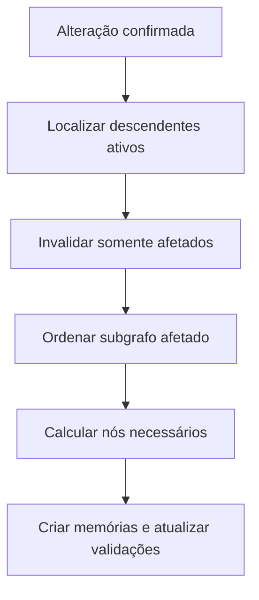
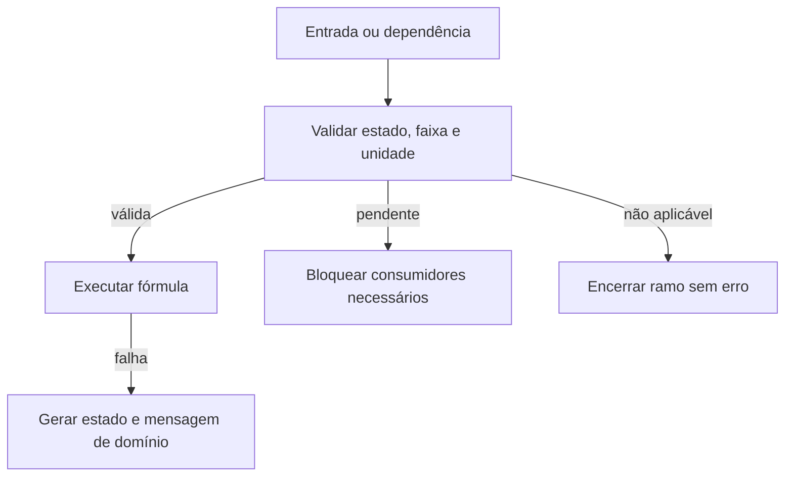
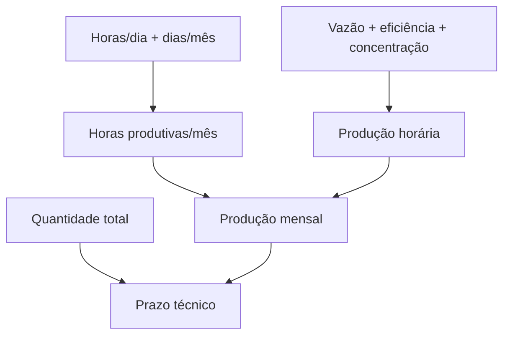
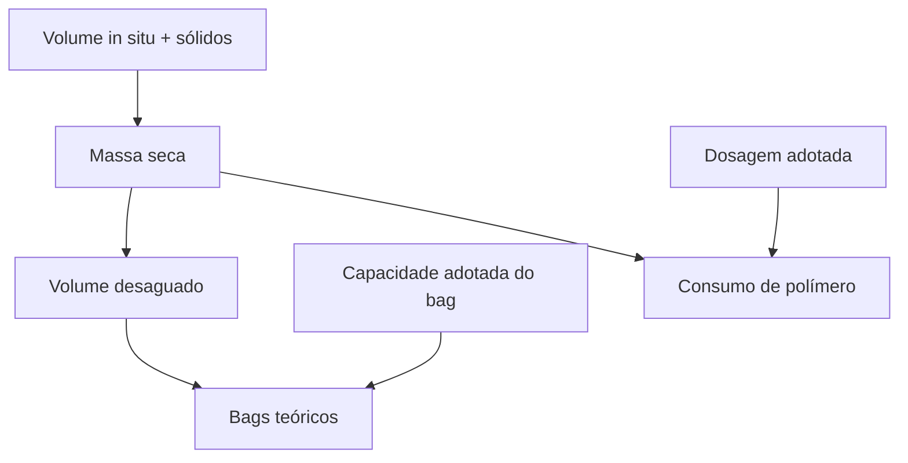
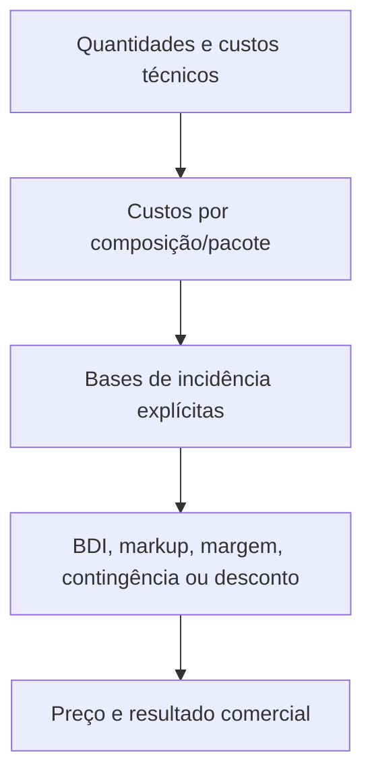

# Motor Lógico de Cálculo e Dependências de Orçamentos

Data: 2026-07-14

Status: definição lógica oficial da Fase 6, tecnológica-neutra e sem implementação.

## 1. Autoridade, objetivo e limites

Este documento define como fórmulas, entradas, dependências, resultados, invalidação, recálculo, unidades, arredondamentos, erros, overrides e memórias de cálculo funcionam conceitualmente no domínio de Orçamentos.

É subordinado ao domínio oficial de `22_DOMINIO_ORCAMENTOS.md` e ao modelo lógico de `23_MODELO_LOGICO_DADOS_ORCAMENTOS.md`. Foi confrontado com o Método FOS, o vocabulário oficial, os crosschecks estrutural e semântico, os documentos das famílias e as análises aprofundadas do Lote Piloto 01. Divergências ou lacunas permanecem provisórias até validação do Fabio.

O motor lógico não é tela, persistência, serviço ou biblioteca. Esta fase não define linguagem de expressão, estrutura física do grafo, classes, funções, arquivos de código, banco, CSV, API, cache físico, mecanismo de eventos ou interface.

## 2. Princípios obrigatórios

1. Fórmula é uma regra de domínio identificada e versionada.
2. Fórmula não pertence à tela.
3. Cada fórmula declara entradas, unidades esperadas, estados aceitos, saída, unidade da saída, dependências, condições de aplicabilidade, arredondamento, validações, versão e explicação em linguagem de domínio.
4. Cada resultado calculado relevante possui memória reproduzível.
5. Alterar uma entrada invalida somente resultados dependentes.
6. Resultado não afetado não é recalculado.
7. Versão congelada preserva resultados e memórias originais.
8. Alterar uma fórmula cria nova versão da regra e não modifica versões antigas do orçamento.
9. Pendente, não aplicável e responsabilidade do cliente não são zero.
10. Erros técnicos são apresentados como validações compreensíveis, nunca como mensagens de planilha.
11. O grafo de um cenário não consome resultados de outro cenário para formar seu resultado.
12. Cadastro mestre, regra vigente e fotografia utilizada pela versão permanecem distinguíveis.
13. O valor bruto, o valor arredondado, o valor custeado e o valor comercial são resultados semanticamente distintos.
14. Cálculo incremental e explicabilidade são requisitos do domínio, não otimizações opcionais.

## 3. Elementos do motor e responsabilidades

| Elemento lógico | Responsabilidade no motor | Invariante principal |
|---|---|---|
| Fórmula | Define transformação determinística e versionada | Uma execução referencia uma versão exata |
| Dependência de Cálculo | Declara precedência, condição e impacto | Dependência ativa tem origem e destino compatíveis |
| Premissa / Parâmetro / Valor Adotado | Fornece entrada contextualizada | Estado, unidade, origem e escopo são explícitos |
| Memória de Cálculo | Fotografa uma execução reproduzível | Não existe resultado relevante sem memória, salvo informado/adotado explicitamente |
| Resultado | Expõe saída técnica, econômica, comercial ou de validação | Validade corresponde à memória e às revisões das entradas |
| Validação / Alerta | Traduz restrições e falhas em linguagem de domínio | Valor inválido não alimenta consumidor como se válido fosse |
| Cenário | Delimita o grafo calculável | Não há agregação produtiva entre cenários |
| Pacote / Composição | Delimita subgrafos e consolidações | Não aplicável remove dependências ativas sem apagar histórico |

## 4. Contrato lógico de fórmula

Cada fórmula deve possuir, no mínimo, o contrato abaixo. O contrato é conceitual; não antecipa formato de armazenamento.

| Campo lógico | Regra |
|---|---|
| Identidade lógica | Estável entre versões da mesma regra; não depende só do nome |
| Nome | Termo reconhecível do domínio |
| Versão | Identifica exatamente o comportamento executado |
| Finalidade | Explica por que o resultado existe e qual decisão sustenta |
| Famílias aplicáveis | Declara famílias confirmadas ou provisórias |
| Pacote ou submodelo | Delimita o contexto de uso |
| Descrição natural | Permite compreensão sem expressão física ou célula de Excel |
| Expressão conceitual | Relação matemática ou decisória em conceitos oficiais |
| Entradas | Lista ordenada de conceitos consumidos |
| Tipo semântico | Natureza física, econômica, temporal, quantitativa ou decisória de cada entrada |
| Unidade esperada | Unidade e grandeza aceitas para cada entrada |
| Obrigatoriedade | Obrigatória, condicional ou informativa |
| Estados aceitos | Estados que permitem execução e comportamento dos demais |
| Faixas | Mínimos/máximos conhecidos; ausência é lacuna explícita |
| Saída | Conceito único produzido pela fórmula |
| Unidade da saída | Unidade e grandeza do resultado bruto |
| Precisão | Precisão interna necessária antes de apresentação |
| Arredondamento | Regra identificada e momento de aplicação |
| Aplicabilidade | Condições de família, pacote, cenário e responsabilidade |
| Validações prévias | Restrições que antecedem a execução |
| Dependências diretas | Origens lógicas necessárias à execução |
| Consumidores | Resultados conhecidos que dependem da saída |
| Entrada pendente | Bloqueia, permite parcial ou adia conforme contrato |
| Pacote não aplicável | Não executa e produz estado não aplicável, sem zero fictício |
| Divisor zero | Produz não calculável e validação compreensível |
| Versão anterior | Referência de linhagem, quando houver |
| Fontes de evidência | Modelos, família, crosscheck, decisão ou política que sustentam a regra |
| Status | Provisória, validada ou aposentada |

### 4.1 Evolução da fórmula

- Correção, mudança de base, unidade, condição, arredondamento ou significado cria nova versão.
- Aposentar impede novas adoções, mas mantém reprodução histórica.
- Versão congelada conserva a fórmula utilizada mesmo se outra se tornar vigente.
- Em versão em elaboração, adotar nova versão é decisão explícita, invalida descendentes e registra histórico.
- Fórmula provisória não se torna validada apenas porque reproduziu um caso; exige evidência e homologação aplicável.

## 5. Grafo conceitual de dependências

O grafo é dirigido e delimitado por versão e cenário. Um nó representa entrada, premissa, parâmetro, valor adotado, resultado intermediário, memória, resultado técnico, econômico, comercial ou validação. Uma aresta declara que a origem influencia o destino.

Cada aresta registra:

- origem e destino identificáveis;
- tipo de dependência;
- condição de ativação;
- pacote, submodelo e cenário;
- impacto esperado;
- obrigatoriedade;
- compatibilidade entre unidade de origem e unidade esperada no destino;
- versão da definição usada na execução.

### 5.1 Tipos mínimos de aresta

| Tipo | Semântica | Exemplo |
|---|---|---|
| Depende diretamente | Destino não é calculável sem origem válida | produção mensal depende de horas produtivas |
| Depende condicionalmente | Dependência existe quando condição é verdadeira | polímero depende de pacote aplicável |
| Agrega | Destino consolida vários resultados homogêneos | custo do pacote agrega custos dos itens |
| Converte unidade | Origem passa por conversão autorizada | tonelada seca para quilograma seco |
| Limita | Origem estabelece teto, piso ou gargalo | capacidade do sistema limita produção |
| Valida | Origem não compõe valor, mas verifica consistência | área disponível valida arranjo de bags |
| Substitui | Valor manual aprovado passa a governar consumidores | prazo manual substitui prazo sugerido |
| Referencia sem recalcular | Destino exibe/rastreia sem ser invalidado pelo valor | resumo referencia evidência congelada |

Uma referência sem recalcular não pode ocultar dependência matemática real. Dependência condicional inativa não propaga invalidação enquanto sua condição permanecer falsa.

## 6. Fluxo de alteração, invalidação e recálculo

O processamento conceitual ocorre assim:

1. Registrar a alteração, origem, autor, momento e revisão lógica da entrada.
2. Localizar resultados diretamente dependentes cujas condições estejam ativas.
3. Propagar invalidação pelos descendentes alcançáveis.
4. Manter válidos nós fora do subgrafo afetado.
5. Verificar ciclos e ordenar topologicamente o subgrafo.
6. Executar apenas nós necessários e aplicáveis.
7. Criar nova memória para cada resultado recalculado.
8. Atualizar validações relacionadas, inclusive as que deixaram de se aplicar.
9. Classificar o impacto percebido: local, pacote, consolidação técnica, econômica ou comercial.
10. Apresentar ao usuário o que mudou, permaneceu válido, ficou pendente ou não calculável.

### 6.1 Exemplo de propagação seletiva

Dosagem de polímero alterada invalida consumo de polímero, custo do polímero, custo do pacote de desaguamento, custo total e preço. Não invalida produção da draga, mobilização ou quantidade de bags quando nenhuma dependência declarada liga esses resultados à dosagem.

### 6.2 Mudanças agrupadas

Várias alterações confirmadas na mesma interação formam um único conjunto de origens. A união dos descendentes é invalidada uma vez, cada nó é executado no máximo uma vez e uma correlação comum permite explicar o lote. Alteração ainda não confirmada pode receber validação local sem disparar consolidação global.

## 7. Ciclos, precedência e cálculo parcial

- O grafo calculável deve ser acíclico.
- Dependência circular é detectada antes da execução do subgrafo.
- Ciclo não resolvido bloqueia os resultados envolvidos e seus consumidores obrigatórios.
- A mensagem identifica os conceitos do ciclo e não mostra coordenadas de células.
- Nenhum valor anterior é apresentado como vigente para mascarar o ciclo.
- Precedência é determinada pelas dependências ativas; ordem de tela ou aba não governa cálculo.
- Cálculo ocorre em camadas topológicas: entradas válidas, resultados intermediários, resultados de pacote, consolidações e incidências comerciais.
- Nós independentes na mesma camada podem ser tratados separadamente sem alterar a semântica.
- Resultado com dependência obrigatória pendente fica bloqueado.
- Resultado parcial só é permitido quando o contrato declara quais componentes podem faltar e rotula explicitamente a parcialidade.
- Submodelos independentes preservam seus resultados válidos mesmo quando outro submodelo está bloqueado.

Mensagem conceitual para ciclo: “Não foi possível calcular porque produção mensal, prazo custeado e equipe mensal formam uma dependência circular nesta configuração. Revise qual valor deve ser entrada adotada.”

## 8. Unidades de medida e compatibilidade dimensional

Cada entrada e saída declara unidade e grandeza. A fórmula opera sobre grandezas compatíveis, não apenas números.

### 8.1 Regras

1. Unidade técnica e unidade econômica são declaradas separadamente.
2. Conversão só ocorre quando autorizada e reproduzível na memória.
3. Conversões que exigem densidade, teor de sólidos, concentração, tempo ou outro parâmetro declaram essa dependência.
4. Percentual e fração não são intercambiáveis silenciosamente.
5. Base úmida, seca, volumétrica e mássica é explícita.
6. Volume in situ, volume de polpa e volume desaguado são grandezas contextualmente distintas.
7. Massa úmida e massa seca são distintas.
8. Hora, dia e mês só são convertidos com calendário/regime declarado.
9. Moeda e data-base acompanham valores econômicos; conversão monetária exige regra própria.
10. Unidade incompatível bloqueia cálculo e informa origem, destino e unidades envolvidas.

### 8.2 Conversões que exigem parâmetro adicional

| Origem → destino | Parâmetro obrigatório | Risco controlado |
|---|---|---|
| Volume in situ → massa seca | teor/fração de sólidos com base declarada e, quando necessário, densidade | confundir fração volumétrica e mássica |
| Massa seca → volume desaguado | fração de sólidos desaguado e base compatível | assumir densidade/base implícita |
| Vazão de polpa → produção de sólidos | concentração adotada com unidade/base | multiplicar grandezas incompatíveis |
| Dia/mês → horas produtivas | jornada, calendário e perdas/eficiência temporal | tratar disponibilidade como produção |
| Volume/massa → unidade econômica | regra contratual de medição | formar preço na base errada |
| Distância/volume → transporte | capacidade, viagens e regra de percurso | ignorar retorno ou carga útil |

As fórmulas iniciais deste documento usam relações simplificadas somente quando as fontes sustentam as mesmas bases. Se densidade ou outra conversão for necessária, a fórmula simplificada é não aplicável.

## 9. Arredondamentos e camadas de valor

Arredondamento é regra identificada e versionada. Nunca é efeito acidental de exibição.

| Camada | Significado | Exemplo |
|---|---|---|
| Valor técnico bruto | Resultado com precisão interna | prazo de 1,924 mês |
| Valor técnico arredondado | Resultado técnico conforme regra declarada | quantidade teórica exibida |
| Valor custeado | Quantidade usada para incidência de custo | 2 meses cobrindo recursos mensais |
| Valor comercial apresentado | Quantidade/preço conforme contrato e apresentação | preço com casas e unidade comercial |

Regras distintas podem existir para prazo técnico, prazo custeado, bags teóricos, bags adquiridos inteiros, viagens, equipes, materiais, moeda interna e preço apresentado. O arredondamento preserva valor anterior, direção, precisão, unidade, justificativa e fonte. Arredondar em etapa intermediária só é permitido quando a regra de domínio assim exigir; caso contrário, cálculos descendentes usam o valor bruto.

## 10. Estados semânticos das entradas

### 10.1 Matriz de estados semânticos

| Estado da entrada | Usa valor | Calcula | Alerta | Bloqueia | Exige decisão |
|---|---:|---:|---:|---:|---:|
| Valor válido | sim | sim | não por si | não | não |
| Zero real | sim, zero | se permitido | conforme contexto | se proibido | quando atípico/ambíguo |
| Pendente | não | não para dependentes obrigatórios | sim | sim | sim |
| Não aplicável | não | remove dependência condicionada | não se justificado | não | sim, com motivo |
| Responsabilidade do cliente | pode ser informativo | não no custo FOS; pode calcular requisito técnico | sim | se requisito não atendido | sim |
| Não informado | não | somente se opcional | conforme obrigatoriedade | se obrigatório | se necessário |
| Não calculável | não | não | sim | sim para consumidores | sim/resolução |
| Erro de validação | valor não é aceito | não | sim | sim conforme severidade | sim |
| Valor manual | sim | sim para consumidores após autorização | sim | conforme governança | sim, com autoria e justificativa |

Não aplicável preserva o dado e a decisão; responsabilidade do cliente pode eliminar custo da FOS sem eliminar dimensionamento, validação ou exclusão comercial; não informado obrigatório se transforma em pendência; valor manual não reescreve o cálculo original.

## 11. Tratamento de erros e validações

### 11.1 Matriz de erros

| Condição | Estado de domínio | Severidade típica | Mensagem esperada | Bloqueia cálculo |
|---|---|---|---|---:|
| Divisor zero | Não calculável | erro de cálculo | Não foi possível calcular o prazo porque a produção mensal é zero ou ainda não foi informada. | sim |
| Referência inexistente | Não calculável | erro de cálculo | O cálculo depende de uma entrada ou resultado indisponível nesta configuração. | sim |
| Unidade incompatível | Erro de validação | bloqueio | A entrada está em uma unidade incompatível com a unidade esperada; revise as unidades indicadas. | sim |
| Dependência pendente | Pendente | pendência | Informe ou resolva a dependência identificada para continuar este cálculo. | sim para consumidor obrigatório |
| Fórmula não aplicável | Não aplicável | informação | Este cálculo não se aplica ao pacote neste cenário. | não |
| Faixa física inválida | Erro de validação | bloqueio | O valor está fora da faixa física aceita para esta regra. | sim |
| Ciclo de dependência | Não calculável | bloqueio técnico | Há uma dependência circular entre os elementos indicados. | sim |
| Cotação vencida | Expirado/pendente | alerta ou bloqueio por política | A referência econômica venceu e requer revalidação. | conforme política |
| Resultado parcial | Parcial identificado | alerta | O resultado considera somente os componentes válidos listados. | não, se contrato permitir |

Severidades mínimas: informação, alerta, pendência, bloqueio e erro de cálculo. A severidade declara impacto sobre execução, aprovação e uso comercial. Justificativa não converte automaticamente bloqueio em valor válido; resolução gera evento rastreável.

## 12. Memória de cálculo e validade

Cada execução relevante cria memória contendo:

- identidade da memória;
- fórmula, identidade e versão;
- expressão conceitual e explicação;
- momento e correlação da execução;
- orçamento, versão, cenário, pacote e submodelo;
- composição ou resultado relacionado;
- entradas, estados, unidades, revisões lógicas e origens;
- conversões e dependências resolvidas;
- resultado bruto;
- resultado arredondado/custeado, quando aplicável;
- unidade, precisão e regra de arredondamento;
- validações, alertas e parcialidade;
- processo ou responsável;
- status de validade;
- causa e momento de invalidação, quando houver.

Estados mínimos da memória: válida, obsoleta por entrada, obsoleta por regra, não calculável, parcial autorizado e congelada. Em elaboração, nova execução gera nova memória vigente e preserva a anterior como evidência. Em versão congelada, memória e resultado não são alterados; nova entrada ou regra exige nova versão do orçamento para novo resultado oficial.

## 13. Contratos dos submodelos

Os contratos abaixo são provisórios onde as fontes não confirmam uma regra universal. “Famílias” indica aplicabilidade observada, não obrigação automática.

### 13.1 Matriz de submodelos

| Submodelo | Família | Entradas principais | Saídas principais | Dependências | Aplicabilidade |
|---|---|---|---|---|---|
| Calendário e horas produtivas | operacionais | horas/dia, dias/mês, turnos, paradas | horas disponíveis/trabalhadas/produtivas | regime e eficiência temporal | padrão em dragagem; adaptado nas demais |
| Produção e prazo | dragagem, bags, centrífuga | quantidade, vazão/capacidade, eficiência, concentração, horas | produção horária/mensal, prazo técnico/custeado | calendário e base física | obrigatório quando há produção |
| Balanço de massa e volume | bags, centrífuga, destinação | volumes, sólidos, densidade/base | massa seca, volumes de processo | unidades e teor de sólidos | condicional à solução |
| Linha de recalque e barrilete | dragagem/bags | comprimentos, diâmetro, acessórios, perdas | configuração, quantidades e custos | produção, geometria, equipamento | condicional |
| Equipe e mão de obra | todas conforme escopo | funções, quantidades, jornada, salários, encargos | horas e custos por função/equipe | calendário e regime | pacote recorrente |
| Equipamento e regime operacional | dragagem, composições | ativo, capacidade, uso, consumo, manutenção | custo horário/mensal e disponibilidade | calendário/equipe | central ou referência |
| Mobilização | todas | origem/destino, ativos, equipe, fretes, montagem | custo e duração de mobilização | configuração do pacote | condicional por responsabilidade |
| Canteiro | operacionais | prazo custeado, instalações, segurança, serviços | custo inicial/mensal/total | prazo, equipe, responsabilidades | recorrente e condicional |
| Bags e células | bags | volume, sólidos, capacidade, dimensões, área, níveis | bags teóricos/adquiridos, área, materiais, repetições | balanço e geometria | central em bags |
| Polímero | bags, centrífuga, paliçada | massa seca, dosagem, preço, água/energia | consumo e custo | balanço e aplicabilidade | opcional; ensaio pode ser necessário |
| Centrífuga | centrífuga | quantidade, capacidade, turnos, sólidos, regime | produção, equipe, consumo e custo | balanço/calendário | central na família |
| Batimetria | batimetria e medição | área, pontos/linhas, equipe, equipamentos, duração | esforço, custo, entregáveis | mobilização e escopo | central ou pacote de controle |
| Carga, transporte e destinação | famílias com descarte | quantidade, distância, capacidade, taxa, responsabilidade | viagens, custo e destino | volume/massa desaguada | opcional |
| Desmobilização | todas quando aplicável | configuração final, equipe, fretes, desmontagem | custo e duração | pacote mobilizado | própria; não espelha automaticamente mobilização |
| Custos por composição | todas | itens, quantidades, incidências, custos unitários | custos unitários, mensais e totais | resultados técnicos e fotografias | obrigatório para pacote custeado |
| Formação de preço | todas | custos, bases, incidências e política | preços, margem/resultado e alertas | consolidação de custos | obrigatório para proposta |
| Consolidação técnica | todas | resultados/pacotes compatíveis | resumo interno rastreável | submodelos técnicos/econômicos | padrão |
| Consolidação comercial | todas | itens técnicos vinculados, unidade econômica, preços | itens e total comercial | formação de preço e escopo | padrão quando ofertado |

### 13.2 Regras comuns a todos os contratos

Para cada submodelo, entradas e saídas preservam estado/unidade/origem; validações antecedem consumidores; parâmetros não universalizáveis ficam identificados; a memória cita evidências e lacunas; aplicabilidade é explícita; e pontos pendentes são submetidos ao Fabio sem virar constante corporativa.

### 13.3 Calendário, produção e balanço

**Objetivo:** converter regime operacional e propriedades físicas em capacidade e prazo reproduzíveis.

- Entradas: jornada, dias, turnos, disponibilidade, perdas, quantidade total, vazão/capacidade, eficiência, concentração, sólidos e bases.
- Saídas: horas produtivas, produção, massa seca, volumes de processo, prazo técnico e prazo custeado.
- Validações: bases de concentração/sólidos, divisor zero, horas negativas, eficiência fora de faixa e unidade econômica incompatível.
- Não universalizar: 22/26/30 dias, eficiência, concentração, perdas, densidade e arredondamento do prazo.
- Evidência: Método FOS, famílias Bags/Centrífuga/Dragagem e modelos piloto `004`, `006`, `007`, `014` e `016`.
- Pendências Fabio: definição corporativa de horas produtivas; bases dos sólidos; quando prazo custeado arredonda para mês inteiro.

### 13.4 Linha, equipamentos, equipe, mobilizações e canteiro

**Objetivo:** dimensionar recursos físicos e temporais que suportam a operação.

- Entradas: trechos de linha, diâmetros, acessórios, ativo, valor, capacidade, regime, equipe, salários, encargos, logística, instalações e prazo custeado.
- Saídas: configuração, quantidades, custos horários/mensais/únicos, duração e validações de capacidade.
- Dependências: produção pode limitar linha/equipamento; calendário governa equipe; prazo governa itens mensais; responsabilidade governa custo FOS.
- Validações: capacidade/gargalo, dupla incidência, vida útil, vigência salarial, cotação, mobilização sem ativo e desmobilização tratada como cópia.
- Não universalizar: manutenção, docagem, oficina, depreciação, juros, composição de equipe, fretes e coeficientes do canteiro.
- Evidência: famílias Dragagem, Composições, Bags, Centrífuga e Batimetria; análises piloto.
- Pendências Fabio: bases oficiais de manutenção/depreciação/juros; fronteira entre canteiro, administração e operação.

### 13.5 Bags, células, polímero e centrífuga

**Objetivo:** dimensionar e custear soluções de contenção e desaguamento.

- Entradas: massa/volume, sólidos, capacidade/dimensões, área, níveis, materiais, repetições, dosagem, produto, água/energia, quantidade e capacidade de centrífugas.
- Saídas: bags teóricos/adquiridos, célula, materiais, consumo de polímero, produção de desaguamento, custos e restrições.
- Dependências: balanço de massa/volume; área valida arranjo; dosagem consome massa seca; regime governa centrífuga; responsabilidades retiram custo sem retirar requisito.
- Validações: capacidade/área, base de dosagem, ensaio, sólidos fora de faixa, pacote duplicado, água/energia sem responsável e gargalo entre draga/desaguamento.
- Não universalizar: capacidade efetiva de bag, fator de enchimento, coeficientes por m², dosagem, vida útil e eficiência da centrífuga.
- Evidência: famílias Bags e Centrífuga; SABESP `D_004_2026` e piloto centrífuga.
- Pendências Fabio: status de 3 kg/t seca; significado dos 20% do barrilete; regra de seleção de bag/célula; capacidade garantida da centrífuga.

### 13.6 Batimetria, transporte e encerramento

**Objetivo:** dimensionar controle/medição, logística do material e retirada da estrutura.

- Entradas: escopo/área/pontos, método, equipe/equipamento, quantidade transportável, distância, capacidade, taxa de destino, responsabilidades e configuração final.
- Saídas: esforço, entregáveis, viagens, custos, destino, duração e desmobilizações.
- Dependências: medição pode referenciar produção sem alterar produção; transporte consome volume/massa compatível; desmobilização depende do que foi mobilizado, mas tem composição própria.
- Validações: método contratual, unidade de medição, destino/licença, distância/percurso, carga útil e responsabilidade.
- Não universalizar: fator comercial de medição, produtividade de levantamento, taxa de destino, retorno de viagem e simetria entre mobilização/desmobilização.
- Evidência: família Batimetria, pacotes recorrentes e piloto Nutrilog/SABESP.
- Pendências Fabio: fronteira entre batimetria técnica e medição contratual; origem do fator 1,3 observado; política de destinação.

### 13.7 Composições, preço e consolidações

**Objetivo:** transformar quantidades técnicas em custos auditáveis e apresentação comercial reconciliada.

- Entradas: itens, recursos fotografados, quantidades, incidências, períodos, custos unitários, bases comerciais, inclusões/exclusões e vínculos técnicos.
- Saídas: custo técnico/direto/indireto/fixo/variável, depreciação, manutenção, juros, contingência, preço, margem/resultado e resumos.
- Dependências: quantidades vêm dos submodelos; itens mensais consomem prazo custeado; incidências declaram base e ordem; itens comerciais vinculam itens técnicos.
- Validações: dupla aplicação, base ausente, BDI/markup/margem confundidos, custo sem origem, preço sem reconciliação e itens puramente comerciais sem justificativa.
- Não universalizar: percentuais, ordem corporativa, BDI por pacote/global, retenções, descontos e faturamento mínimo.
- Evidência: todas as famílias, Método FOS e análises piloto.
- Pendências Fabio: política oficial de incidências, bases e alçadas para override comercial.

## 14. Fórmulas iniciais de referência

Todas as fórmulas desta seção são **provisórias** e só se aplicam quando unidades, bases e condições declaradas forem compatíveis.

### 14.1 Grafo de produção e prazo

### 14.2 Grafo de bags e polímero

### 14.3 Matriz de fórmulas

| Fórmula | Versão | Entradas | Unidades / bases | Saída | Arredondamento | Fonte |
|---|---|---|---|---|---|---|
| horas_mês = horas_dia × dias_mês | provisória 1 | jornada, dias | h/dia; dia/mês | h/mês | nenhum no bruto | famílias e pilotos |
| produção_horária = vazão_operacional × eficiência_adotada × concentração_adotada | provisória 1 | vazão, eficiência, concentração | base da vazão e concentração explícita | quantidade/h | nenhum no bruto | Método e dragagem |
| produção_mensal = produção_horária × horas_produtivas_mês | provisória 1 | produção horária, horas | unidades compatíveis | quantidade/mês | nenhum no bruto | recorrente |
| prazo_técnico = quantidade_total ÷ produção_mensal | provisória 1 | quantidade, produção | mesma base de quantidade | mês | separado do custeado | recorrente |
| massa_seca = volume_in_situ × fração_de_sólidos_in_situ | provisória 1 | volume, sólidos | somente se base suportar; densidade quando necessária | massa seca ou equivalente declarado | nenhum no bruto | Bags/SABESP |
| volume_desaguado = massa_seca ÷ fração_de_sólidos_desaguado | provisória 1 | massa seca, sólidos | base/densidade compatíveis | volume desaguado | nenhum no bruto | Bags/SABESP |
| quantidade_teórica_de_bags = volume_a_acondicionar ÷ capacidade_adotada_por_bag | provisória 1 | volume, capacidade | volume/bag compatível | bag teórico | aquisição inteira em regra separada | Bags |
| consumo_de_polímero = massa_seca × dosagem_adotada | provisória 1 | massa seca, dosagem | ex.: t seca e kg/t seca | kg | comercial conforme embalagem | Bags/Centrífuga |
| custo_item = quantidade_adotada × custo_unitário_adotado | provisória 1 | quantidade, custo unitário | mesma unidade econômica | moeda | política monetária separada | todas as famílias |

As relações de massa/volume são bloqueadas quando a base de sólidos não sustenta a dimensão declarada. O motor não corrige silenciosamente a fórmula introduzindo densidade implícita.

## 15. Matriz de invalidação

| Alteração | Resultados diretamente afetados | Propagação | Não afetados sem aresta declarada |
|---|---|---|---|
| Horas/dia ou dias/mês | horas produtivas e produção mensal | prazo, itens mensais, custos e preço | mobilização fixa e cotações |
| Vazão/eficiência/concentração | produção horária/mensal | prazo, operação e custos temporais | capacidade de bag e salários unitários |
| Volume total | prazo e balanço de massa | bags, polímero, operação, transporte, custos/preço | mobilização fixa |
| Teor de sólidos | massa seca/volume de processo | bags, polímero, centrífuga, destinação | calendário |
| Capacidade/tipo de bag | bags teóricos e arranjo | aquisição, frete, instalação, custo/preço | produção da draga e salários |
| Área da célula | materiais e repetições | custo da célula e total | produção da draga |
| Dosagem de polímero | consumo de polímero | custo do polímero, pacote, total e preço | bags, mobilização e produção da draga |
| Quantidade/capacidade de centrífugas | produção do desaguamento | equipe, prazo, operação, custo e cenários | mobilização da draga quando independente |
| Custo unitário fotografado | custo do item | composição, pacote, total e preço | resultados técnicos |
| BDI/markup/margem/desconto | incidência correspondente | preço, resultado e resumo comercial | produção e custo técnico |
| Agrupamento comercial | item/resumo comercial | total apresentado | memória e custo técnico |
| Responsabilidade do cliente | custo FOS do objeto | pacote/preço e exclusões | requisito/dimensionamento técnico quando necessário |
| Fórmula adotada | resultado da fórmula | todos os descendentes ativos | nós sem dependência |

## 16. Formação de custo e preço

O motor distingue formalmente:

- custo técnico: custo derivado da solução e recursos;
- custo direto: atribuível diretamente ao serviço/pacote conforme regra;
- custo indireto: compartilhado/administrativo com base explícita;
- custo fixo e variável: comportamento no cenário declarado;
- depreciação, manutenção e juros de capital: componentes próprios, com base e período;
- contingência: reserva explícita para risco;
- BDI: incidência declarada sobre base definida;
- markup: multiplicador de formação de preço;
- margem: relação entre resultado e receita conforme base;
- desconto: redução entre referência e preço adotado;
- preço: resultado comercial, não sinônimo de custo.

Cada incidência declara tipo, base, ordem, unidade, vigência, aplicabilidade e fonte. O motor detecta bases sobrepostas e dupla aplicação por rastreabilidade das parcelas. BDI, markup e margem nunca são convertidos automaticamente entre si. Percentuais observados nos Excel são evidências históricas, não políticas corporativas.

## 17. Resultado manual e override

Override só é permitido quando a governança do conceito autorizar. Ele não altera a fórmula nem apaga a memória original.

O registro contém:

- resultado calculado original e sua memória;
- valor manual, unidade e estado adotado;
- autor, momento, justificativa e evidência;
- escopo, validade e condição de expiração;
- consumidores posteriores que passam a usar o manual;
- impacto técnico, econômico e comercial;
- aprovação adicional, quando o resultado for crítico;
- decisão que reverte ou substitui o override.

A aresta “substitui” torna o valor manual a origem vigente para consumidores autorizados. O resultado calculado permanece consultável e comparável. Alteração de entrada pode recalcular o resultado sugerido e alertar que o override precisa ser reavaliado, sem removê-lo silenciosamente.

## 18. Desempenho e experiência suportados

O motor lógico sustenta:

- cálculo incremental e invalidação seletiva;
- ausência de recálculo global por padrão;
- reutilização de resultados cuja validade foi comprovada;
- carregamento do grafo apenas da versão/cenário ativo e dos subgrafos necessários;
- execução delimitada por pacote ou submodelo;
- processamento de mudanças agrupadas;
- uma única execução de cada nó por interação lógica;
- validações locais rápidas antes de consolidações;
- separação entre cálculo e persistência remota;
- preservação do orçamento, versão, cenário, etapa, pacote e posição lógica do usuário;
- sinalização clara de operações demoradas e do impacto previsto.

Não se define tecnologia de cache. Qualquer reaproveitamento futuro depende de fórmula/versão, revisões das entradas, cenário, aplicabilidade, unidades e validações. Persistir ou carregar não é motivo conceitual para recalcular.

## 19. Protocolo de equivalência com os Excel

1. Escolher e identificar o modelo de referência e sua versão.
2. Registrar todas as entradas, estados, unidades, origens e bases.
3. Registrar as fórmulas relevantes e constantes embutidas sem promovê-las a regra universal.
4. Registrar resultados intermediários e políticas de arredondamento.
5. Executar o submodelo com a fórmula/versão candidata.
6. Comparar resultado por resultado, não apenas o preço final.
7. Definir tolerância por grandeza e camada de arredondamento antes da conclusão.
8. Explicar toda diferença por entrada, fórmula, unidade, precisão, erro histórico ou decisão.
9. Reconciliar custos por pacote e composições.
10. Reconciliar incidências, preço final e resumo comercial.
11. Preservar erros do Excel como evidência; não reproduzir erro técnico como comportamento desejado.
12. Homologar a equivalência ou registrar bloqueios e divergências aceitas.

O primeiro modelo obrigatório é `D_004_2026 - SABESP.xlsx`. Depois dele, deve ser testado ao menos um representante de cada família. O objetivo é equivalência explicada: resultados iguais quando a regra histórica é válida e diferenças justificadas quando o legado contém erro, ambiguidade ou regra rejeitada.

### 19.1 Matriz de equivalência inicial

| Modelo | Submodelo | Resultado Excel | Resultado esperado | Tolerância | Status |
|---|---|---|---|---|---|
| D_004_2026 - SABESP.xlsx | produção e prazo | a registrar na execução controlada | mesmo intermediário com mesmas bases | a definir por grandeza | obrigatório, pendente |
| D_004_2026 - SABESP.xlsx | balanço/bags/polímero | a registrar | mesma cadeia válida ou diferença explicada | a definir antes do teste | obrigatório, pendente |
| D_004_2026 - SABESP.xlsx | custos por pacote | a registrar | reconciliação por pacote | monetária definida antes do teste | obrigatório, pendente |
| D_004_2026 - SABESP.xlsx | preço final | a registrar | mesmo preço com mesmas incidências | monetária definida antes do teste | obrigatório, pendente |
| Representante Bags | conjunto aplicável | a selecionar | equivalência explicada | por resultado | pendente |
| Representante Centrífuga | conjunto aplicável | a selecionar | equivalência explicada | por resultado | pendente |
| Representante Dragagem | conjunto aplicável | a selecionar | equivalência explicada | por resultado | pendente |
| Representante Batimetria | conjunto aplicável | a selecionar | equivalência explicada | por resultado | pendente |
| Representante Composições | conjunto aplicável | a selecionar | equivalência explicada | por resultado | pendente |

## 20. Confronto com domínio e modelo lógico

| Exigência anterior | Atendimento neste motor |
|---|---|
| Fórmula identificada/versionada | contrato completo e evolução sem sobrescrita |
| Dependência de cálculo | aresta tipada, condicional, dimensional e contextual |
| Memória reproduzível | fotografia de execução, estados, unidades e validade |
| Resultado | classificação, camadas de arredondamento e consumidores |
| Validação e alerta | severidade, mensagem de domínio e impacto |
| Estados semânticos | matriz sem conversão implícita para zero |
| Cenário e pacote | grafo isolado e subgrafos por aplicabilidade |
| Versão congelada | resultados/memórias imutáveis |
| Fotografia de referência | valor econômico usado não muda com mestre |
| Histórico, decisão e aprovação | alteração, override e adoção rastreáveis |
| Desempenho/UX | invalidação seletiva, carregamento e execução delimitados |

As entidades de cálculo definidas na Fase 5 permanecem respeitadas; este documento especializa comportamento, não cria estrutura física concorrente.

## 21. Decisões consolidadas

1. O motor é um grafo lógico dirigido por cenário.
2. O subgrafo calculável deve ser acíclico; ciclo é bloqueio explícito.
3. Fórmulas e regras de arredondamento são versionadas.
4. Dependências condicionais seguem aplicabilidade e responsabilidade.
5. Invalidação percorre somente descendentes ativos.
6. Memória acompanha todo resultado calculado relevante.
7. Estados semânticos governam participação no cálculo.
8. Compatibilidade dimensional antecede execução.
9. Custo e preço são cadeias distintas e reconciliáveis.
10. Override preserva cálculo original, autoria, justificativa e impacto.
11. Equivalência é comprovada por intermediários, pacotes e preço, começando pela SABESP.
12. Reutilização de resultado exige validade comprovada, sem definir cache físico.

## 22. Decisões adiadas — parking lot

- linguagem de expressão;
- mecanismo físico do grafo e sua ordenação;
- biblioteca matemática;
- classes, funções ou arquivos Python;
- banco, CSV ou outro formato de persistência;
- representação física de fórmula, memória e unidade;
- cache físico e política técnica de armazenamento;
- processamento assíncrono;
- interface, componentes e navegação;
- mecanismo físico de eventos;
- persistência das memórias;
- concorrência, transações e filas;
- percentuais e parâmetros corporativos ainda não homologados;
- tolerâncias finais por fórmula/família;
- alçadas físicas de override e aprovação.

Nenhum item pode ser decidido por conveniência da tecnologia atual durante esta fase.

## 23. Critérios de encerramento

Sem abrir código, esta definição permite responder:

- fórmula é regra identificada/versionada com contrato completo;
- entradas são validadas por estado, faixa, unidade, base e aplicabilidade;
- dependências são arestas tipadas, condicionais e contextualizadas;
- mudança invalida somente descendentes ativos;
- recálculo segue ordem topológica do subgrafo afetado;
- falhas são estados e mensagens de domínio;
- memória preserva fórmula, entradas, unidades, resultado e validade;
- override substitui origem vigente sem apagar cálculo original;
- cálculo incremental evita execução global e repetida;
- equivalência será provada por resultados intermediários, pacotes e preço.

## 24. Encerramento

A Fase 6 define o motor lógico sem implementar comportamento físico. O próximo passo recomendado, somente após homologação do Merlin, é modelar o fluxo do usuário e a arquitetura física mínima, mantendo separadas as decisões de persistência, interface e tecnologia de cálculo.

## Correção de seleção técnica — AUDIT_054

Cliente não é entrada de seleção do motor técnico. Fórmulas são elegíveis por pacote, submodelo, capacidade requerida, condições técnicas da obra, aplicabilidade do cenário e versão da regra. O motor pode consumir parâmetros técnicos cuja origem seja o cliente, mas nunca o nome ou identidade do cliente como chave lógica.

São erros arquiteturais funções, constantes ou desvios equivalentes a `calcular_orcamento_sabesp()`, `if cliente == "SABESP"` ou BDI técnico indexado por cliente. Condições comerciais contextualizadas podem influenciar preço, desde que separadas do grafo técnico, com base, origem e decisão explícitas.

O Excel SABESP permanece caso inicial de equivalência integral da família técnica aplicável, não seletor de fórmula nem template universal.
